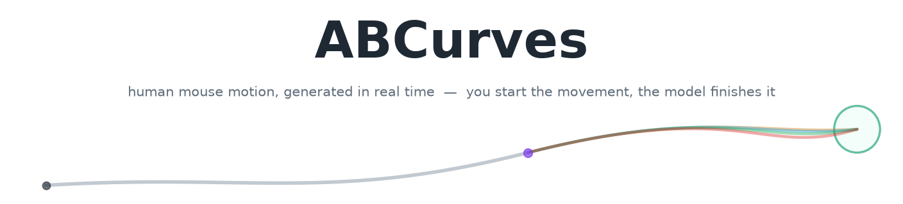
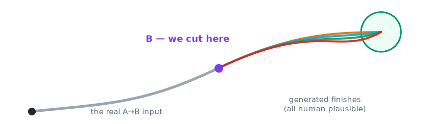
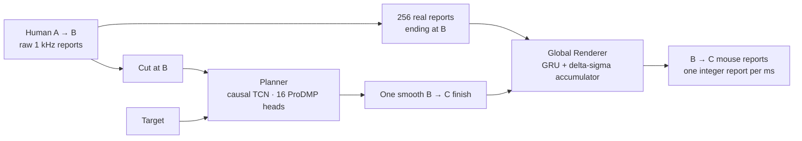
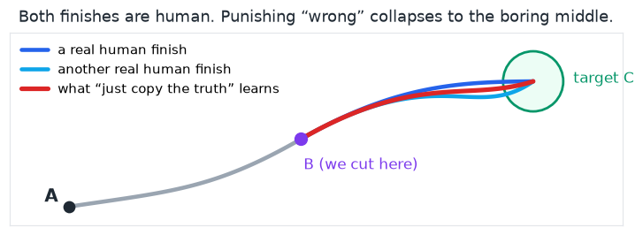
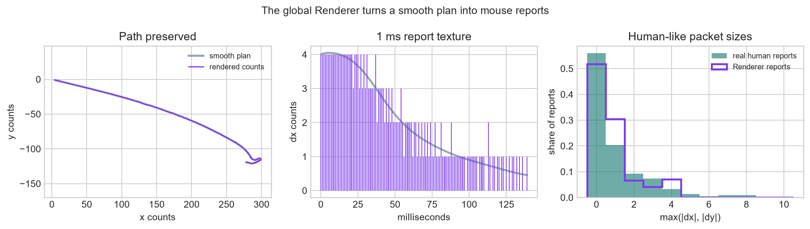

<p align="center">
  
</p>

<p align="center">
  A person starts aiming at a target. ABCurves watches the first part of the movement,
  then finishes it the way that person might have finished it themselves.
</p>

<p align="center">
  <a href="https://optima-manent.github.io/ABCurves/"><b>▶ Live demo</b></a> ·
  <a href="DETECTION.md"><b>Detection study</b></a> ·
  <a href="docs/TRAINING_AND_INFERENCE.md">Train &amp; run</a> ·
  <a href="docs/DATASET.md">Dataset</a> ·
  <a href="https://discord.gg/Nyf272vUjz">Discord</a>
</p>

<p align="center">
  <a href="LICENSE"></a>
  
  
  <a href="DETECTION.md"></a>
</p>

---

## The short version

A mouse movement is a small time series. Roughly every millisecond, the mouse reports
two integers telling the computer how far it just moved. A fast flick, a slow drag,
and the tiny correction before a click are each a few hundred of these reports in a
row.

The first goal of ABCurves was to generate movement inside ordinary human variation.
That is already a surprisingly deep problem. A smooth line is not enough. Real
movement has changing speed, corrections, pauses, bursts, and the quantized rhythm
of physical hardware.

But looking like *some* human was never the most interesting goal.

**The real goal is to continue a movement so that the result looks like the same
human who started it.** ABCurves watches the real beginning, reads how that person is
moving, and generates only the finish. The Planner chooses the shape of the curve;
the global Renderer turns it into the raw 1 kHz reports a mouse would actually send.

The repository contains the frozen models, complete data builders, training code,
streaming Python and C runtimes, and the [detection study](DETECTION.md) used to
challenge the result.

---

## The idea behind A → B → C

The common approach is to choose a start A and a target C, then generate the whole
movement between them. I think that asks the model to throw away its best evidence.

ABCurves solves this version instead:

> The human starts the movement. We watch them travel from A toward the target, cut
> at B, and generate only the finish from B to C.

<p align="center">
  
</p>

The point is not that generating half a movement is half the work. **The first half
is information.** It reveals the current speed, direction, correction pattern, hand,
mouse, sensitivity, and packet rhythm. A generator starting from nothing has to
invent all of those. A real A→B prefix lets the finish inherit them.

If the person begins with a fast flick, the finish should end like a flick. If they
are making a slow, careful adjustment, it should land like one. That is the leap from
producing something broadly human-like to continuing **this human movement**.

---

## One problem, two models

Movement shape and millisecond hardware texture are different problems. Trying to
make one small real-time model learn both blurred them together, so ABCurves gives
each problem its own tool.

1. **The Planner** reads A→B and the target, then chooses a smooth B→C finish. It
   decides the path, timing, bend, and landing.
2. **The global Renderer** turns that plan into the integer reports of a real mouse.
   It restores the gaps, bursts, cadence, and hardware texture without losing the
   planned path.

Here is the whole system at a glance:



### The Planner learns the whole finish

Planning a movement as hundreds of unrelated `dx, dy` predictions is difficult. A
small error at one step changes the next step, and the whole trajectory can drift.
ABCurves instead predicts the finish as one object using **ProDMP**.

The intuition behind ProDMP is simple: a wide range of smooth human curves can be
written as mixtures of a small set of motion patterns. Think of those patterns as
motion features. The network learns how strongly to mix them, while ProDMP builds the
position and velocity already present at B directly into the curve.

```text
finish(t) = boundary from B + motion patterns(t) × learned weights
```

That solves the time-series problem, but there is another one. Two almost identical
beginnings can have different, equally valid human finishes. If an ordinary
similarity loss punishes the model whenever it does not copy the single recorded
answer, all of those valid possibilities pull it toward their average. The average
may be a dull curve that no person actually drew.

<p align="center">
  
</p>

The Planner therefore has **sixteen ProDMP heads**. That number was not arbitrary: it
matched the average number of statistically equivalent finish modes I found in the
human data. During training, the head closest to the recorded finish learns most from
that example, so the heads can specialize instead of collapsing into one average. At
runtime, ABCurves samples one head; it does not generate sixteen answers and secretly
keep the best one.

### The global Renderer learns texture everywhere, from anyone

The Planner produces a clean curve, but physical mice communicate in small integer
steps. Many reports are zero, motion arrives in short bursts, and the rhythm changes
with speed, direction, the hand, and the device.

<p align="center">
  
</p>

The global Renderer learns this translation from uninterrupted 1 kHz recordings
across many people, mice, speeds, and movement types. It is one shared model rather
than a separate model for each person. At runtime it reads 256 genuine reports ending
at B, adapts once to the active session, and can then texture the smooth finish.

Inside it, a GRU decides when to emit and which nearby two-axis integer report fits
that moment. A delta-sigma accumulator remembers fractional motion until it can be
released as an integer count, so texture does not quietly destroy the path through
rounding.

The Renderer is now small enough to run without a machine-learning framework. The
repository includes its no-heap C99 runtime, so it can be integrated into small
computers and experimentally ported to ESP32-class devices. USB integration and
timing on a particular board still belong to the device developer.

The complete corpus, training budget, GRU law, quantization, safeguards, selection
score, and embedded API are documented in
[Training and inference](docs/TRAINING_AND_INFERENCE.md).

---

## What did the measurements show?

This was the part of the project I was most excited to reach. Looking at curves is
useful, but eventually I wanted answers I could measure. Does the output merely sit
somewhere inside the huge category of “human-like,” or does it stay close to the
human movement it is continuing? And if a completely new person arrives, can a
judge catch the generated movement without also accusing real people?

### 1. How closely does the Renderer mirror the human?

The cleanest test gives the Renderer the correct smooth human path and judges only
the raw packet texture it recreates. Texture19 measures nineteen properties of that
1 kHz output. Lower distance means closer behavior.

| Texture being compared | Distance |
|---|---:|
| Two independent samples from one real session | 0.150 |
| The same person/setup in another session | 0.240 |
| **Renderer output and the human session it follows** | **0.263** |
| The closest different person/setup | 0.280 |
| The average different person/setup | 0.639 |

At **0.263**, the Renderer lands inside the local human range: it is close to the same
source recorded in another session, closer than the nearest different source, and
**about 59% smaller than the average distance between different people or setups**.
The global model is not merely adding generic jitter; it recreates texture on the
local human scale. Human movement itself sometimes varies more: in **3 of 35**
same-session comparisons, two real-human samples were farther apart than the Renderer
was from the human it followed.

### 2. Can it be detected without knowing the person first?

The cold test hides every recording from the person or setup being judged and tests
the complete ABCurves pipeline. Its human-safe judges caught **none of 1,280**
generated trials. A broader search found 6 of 40 fully generated groups,
but it also accused genuine movement from two of six unseen humans. That is not a
safe way to identify ABCurves, which remained **undetectable in this practical cold
setting**.

A warm detector gets a much easier problem: trusted clean movement from the exact
same recorded session. Before testing, a separate set of real movements fixes how
strong the evidence must be before raising a flag. At that cutoff it caught **90%
(36 of 40)** fully generated groups while also flagging 2 of 40 held real-human
groups. That is a thin, brittle separation, not a line a detector can assume will
remain fixed.

Warm detection is best understood as a laboratory upper bound. It assumes the
reference remains clean and perfectly matched. In real use, changing sensitivity,
mousepad, grip, posture, fatigue, or habits can shift a person's movement by more
than the small residual difference the warm judge is trying to find. A stale warm
reference can therefore stop helping or begin accusing genuine change, while a
larger population gives rare human outliers more chances to cross the same boundary.

The full **[detection study](DETECTION.md)** explains what the judges measure, the
Renderer-only result, the complete-pipeline cold and warm tests, and the exact
boundary of every claim. It is one of the main results of this repository, not a
side benchmark.

---

## Try it

```bash
git clone https://github.com/optima-manent/ABCurves.git
cd ABCurves
python -m pip install -e .
```

The Windows package already includes the native Renderer. On macOS or Linux, build
it once before the first run:

```bash
cmake -S runtime/c -B runtime/c/build
cmake --build runtime/c/build --config Release
```

Then run:

```bash
python examples/quickstart.py
```

The Planner prefix and Renderer context are related, but they have different
contracts. The Planner accepts the A→B movement. The Renderer requires
**exactly 256 chronological integer reports ending at the same B**.

```python
import numpy as np
from abcurves import Pipeline

planner_prefix = np.asarray(prefix_raw_dxdy, dtype=np.float32)
renderer_context = np.asarray(last_256_raw_reports, dtype=np.int16)
assert renderer_context.shape == (256, 2)

with Pipeline.from_pretrained() as pipeline:
    counts = pipeline.generate(
        planner_prefix,
        renderer_context_raw_dxdy=renderer_context,
        target_rel_at_B=(140.0, -22.0),
        target_radius=18.0,
        progress_center=0.72,
        seed=2026,
    )

assert counts.dtype == np.int16
```

The runtime does not guess, pad, or silently take the last 256 rows of a longer
buffer. Choose the exact chronological context explicitly. If the Planner prefix is
itself exactly 256 reports, it may serve as the Renderer context and the extra
argument can be omitted.

[`examples/quickstart.py`](examples/quickstart.py) has only a compact event fixture,
so it declares an example-only quiet history before its shorter prefix. A real
integration should retain genuine session history instead. For one-report-at-a-time
output, see [`examples/streaming.py`](examples/streaming.py).

ABCurves returns integer reports; it does not own a USB device. Polling, queues,
permissions, firmware, and the final HID write remain the caller's responsibility.

---

## Train it on your own data

The two branches deliberately accept different information.

- The **Planner** needs audited A→C events with target geometry and outcomes.
- The **Renderer** needs uninterrupted 1 ms mouse reports.

A validated Capture export tree contains both, so it can build both branches:

```bash
python -m pip install -e ".[data]"

python tools/prepare_dataset.py validated_exports/ prepared/ \
  --config configs/final.json --branch both
```

A portable `events.npz` can build the Planner only:

```bash
python tools/prepare_dataset.py events.npz prepared_planner/ \
  --config configs/final.json --branch planner
```

A portable `abcurves.full_sessions.v1` `sessions.json` can build the Renderer only:

```bash
python tools/prepare_dataset.py full_sessions/sessions.json prepared_renderer/ \
  --config configs/final.json --branch renderer
```

The tool fails closed when the chosen input does not contain the history required by
the requested branch.

```bash
python training/train_planner.py \
  --train prepared/planner_train.npz \
  --val prepared/planner_val.npz \
  --out runs/planner_retrained.pt

python training/train_renderer.py \
  --train prepared/renderer_train \
  --val prepared/renderer_val \
  --out runs/renderer_retrained.pt
```

The Renderer command writes a float checkpoint that can be used directly in the
same pipeline:

```python
from abcurves import Pipeline

with Pipeline(float_renderer_checkpoint="runs/renderer_retrained.pt") as pipeline:
    counts = pipeline.generate(
        planner_prefix,
        renderer_context_raw_dxdy=renderer_context,
        target_rel_at_B=(140.0, -22.0),
        target_radius=18.0,
        progress_center=0.72,
        seed=2026,
    )
```

The retrained checkpoint uses the same public Pipeline API. Candidate Renderers are
scored with `python -m evaluation renderer-selection ...`, because sampled texture—not
teacher-forced loss—is the behavior that matters. Dataset formats are explained in
[DATASET.md](docs/DATASET.md); the complete training and runtime recipe is in
[TRAINING_AND_INFERENCE.md](docs/TRAINING_AND_INFERENCE.md).

---

## What is in the repository?

```text
abcurves/
  pipeline.py            load-once Planner → Renderer API
  planner.py             smooth path, timing, and landing
  renderer.py            float Renderer training and checkpoint runtime
  portable_renderer.py   authenticated native runtime binding
  global_data.py         whole-session Renderer dataset builder
  preprocessing.py       event-aligned Planner dataset builder
  judges.py              similarity and detection measurements

models/                   two Planners, one global Renderer, integrity manifest
runtime/c/                no-heap C99 Renderer runtime and loader test
training/                 Planner and Renderer training programs
evaluation/               similarity and detector experiments
results/                  compact result receipts
examples/                 quick start, streaming, benchmark, and sample data
docs/                     dataset, training, inference, and FAQ guides
tests/                    model, runtime, data, seam, and evaluation checks
```

The small example data demonstrates formats and runs smoke tests. It is not the full
contributed hardware corpus used to select the release.

---

## The people who made this possible

Roughly 100 people took time to run ABCurves Capture and share real sessions from
their hands, mice, computers, and settings. That data made it possible to move beyond
“this looks convincing” and test the idea across real hardware and real human
variation.

Thank you, and know that this release exists because of you :)

The complete movement corpus is not bundled yet. It is valuable, still growing, and
deserves careful handling. If you want to work with it, join the
**[Discord](https://discord.gg/Nyf272vUjz)** and contribute a Capture session.
Contributors can request research access, and the intention is to publish the full
corpus for everyone later.

---

## Acknowledgements and citation

The Planner's movement representation builds on **ProDMP**:

> Ge Li, Zeqi Jin, Michael Volpp, Fabian Otto, Rudolf Lioutikov, Gerhard Neumann.
> *ProDMP: A Unified Perspective on Dynamic and Probabilistic Movement Primitives.*
> arXiv:2210.01531, 2022. <https://arxiv.org/abs/2210.01531>

If ABCurves helps your work, cite this repository:

```bibtex
@software{abcurves,
  title  = {ABCurves: Real-Time Human-Conditioned Mouse-Motion Continuation},
  author = {Optima Manent},
  year   = {2026},
  url    = {https://github.com/optima-manent/ABCurves}
}
```

Released under the [MIT License](LICENSE).

---

## Support the project

Many people have kindly asked if they can support my work financially. ABCurves
will always stay free and open source. It was built for the community, with the help
of the community, and that will never change.

If you still insist, you can **[support my work here](https://github.com/sponsors/optima-manent?frequency=one-time)**.
It helps cover a little of the hundreds of hours that went into ABCurves. And thank
you, it genuinely means a lot. :)

---

<p align="center"><sub>
  A mouse movement is a small time series, and finishing one like a human
  turned out to be a deeper problem than it looks.
</sub></p>
