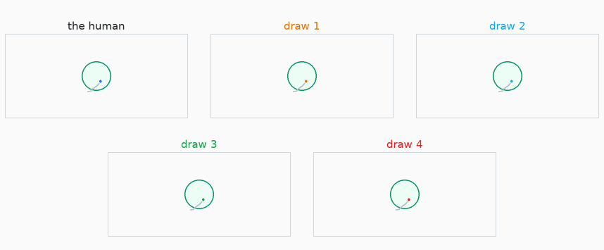
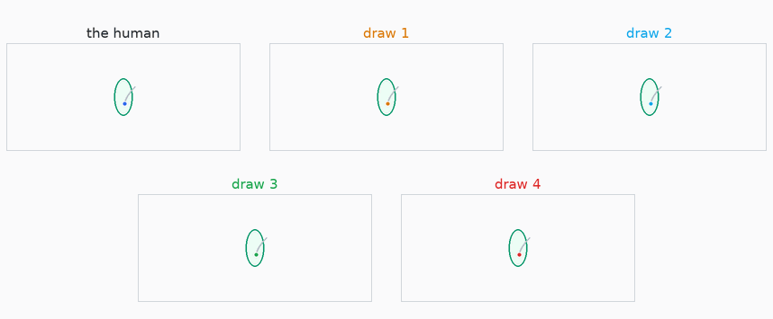
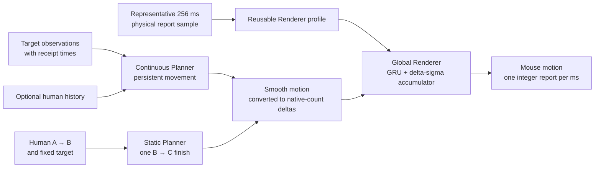

<p align="center">
  
</p>

<p align="center">
  Human mouse movement, one millisecond at a time. Follow a changing target,
  or continue the movement a person has already begun.
</p>

<p align="center">
  <a href="https://optima-manent.github.io/ABCurves/"><b>▶ Live demo</b></a> ·
  <a href="docs/INTEGRATION.md"><b>Get started</b></a> ·
  <a href="DETECTION.md"><b>Detection study</b></a> ·
  <a href="docs/TRAINING_AND_INFERENCE.md">Train &amp; run</a> ·
  <a href="docs/DATASET.md">Dataset</a> ·
  <a href="https://discord.gg/Nyf272vUjz">Discord</a>
</p>

<p align="center">
  <a href="LICENSE"></a>
  
  
  <a href="DETECTION.md"></a>
</p>

---

## The short version

A mouse movement is a small time series. Roughly every millisecond, the mouse reports
two integers telling the computer how far it just moved. A fast flick, a slow drag,
and the tiny correction before a click are each a few hundred of these reports in a
row.

The first goal of ABCurves was to generate movement inside ordinary human variation.
That is already a surprisingly deep problem. A smooth line is not enough. Real
movement has changing speed, corrections, pauses, bursts, and the quantized rhythm
of physical hardware.

But looking like *some* human was never the most interesting goal.

**The real goal is for every continuation to feel like it came from the same hand.** A
fast flick should finish like a flick. A careful adjustment should stay careful.
And when the target keeps moving, the next correction should grow out of the
movement already underway.

ABCurves offers two ways to do this. The **Continuous Planner** generates an ongoing
stream as targets change, starting independently or from a human movement history.
The **Static Planner** watches a real beginning and generates its finish toward a
fixed target. Both can use the same global **Renderer**, which turns smooth intent
into 1 kHz reports that carry the texture of a particular person's hand, mouse,
and setup.

The repository contains the frozen models, complete data builders, training code,
streaming Python and C runtimes, and the [detection study](DETECTION.md) used to
challenge the Static Planner and Renderer.

---

## Two ways to plan

| Planner | A good fit for | How you use it |
|---|---|---|
| **Continuous Planner** · default | Following changing targets, repeated corrections, acquisition and settling | Keep one stream alive, send target observations with their receipt times, and obtain movement. Human history is optional at the start. |
| **Static Planner** | Completing a target-directed gesture from a real human beginning | Supply the observed A→B movement and fixed target, then obtain one complete B→C finish. |

A moving target makes the problem much harder. Reaching it is only part of the
job. The movement also needs variation, little corrections, hesitation, braking,
the occasional pause, and a convincing way to begin again. Push too hard on target
error and those details disappear. Preserve variation without enough purpose and
the hand wanders instead of getting where it meant to go.

The Continuous Planner balances these demands with several small learned parts.
A ProDMP motor proposes motion, a selector carries a coherent choice between
plans, and activity and braking models shape the transitions into and out of
stillness. That gives pursuit and settling room to behave differently, while
keeping them part of one continuous movement.

These two examples show the selected planner following a freely roaming target
and a path with sharp changes of direction. Each compares the recorded human with
four generated movements, with a faint target guide to help you read the scene.

<p align="center">
  
</p>
<p align="center">
  
</p>

The [live demo](https://optima-manent.github.io/ABCurves/) lets you play, pause and
look more closely. The Static Planner remains a useful choice when the task is
one finite finish, because its observed beginning anchors the whole gesture.

---

## The idea behind A → B → C

For a fixed target, the beginning of a movement is an unusually useful clue. It
was the starting point of ABCurves, and it remains the Static Planner's question:

> The human starts the movement. We watch them travel from A toward the target, cut
> at B, and generate only the finish from B to C.

<p align="center">
  
</p>

The point is not that generating half a movement is half the work. **The first half
is information.** It reveals the current speed, direction, correction pattern, hand,
mouse, sensitivity, and packet rhythm. A generator starting from nothing has to
invent all of those. A real A→B prefix lets the finish inherit them.

If the person begins with a fast flick, the finish should end like a flick. If they
are making a slow, careful adjustment, it should land like one. That is the leap from
producing something broadly human-like to continuing **this human movement**.

---

## Shape, choice, and texture

Human movement has structure at two very different scales. Over a few hundred
milliseconds, a flick gathers speed, bends toward its target and slows to a stop.
Inside that same gesture are hundreds of tiny 1 kHz reports, full of zeros, bursts
and integer steps. The overall movement and the way a particular hand and mouse
report it are connected, but learning one does not automatically teach the other.

Asking one small model to learn both at once blurred them together. ABCurves gives
each scale its own job.

1. **A Planner** chooses an ongoing smooth trajectory for Continuous, or a complete
   B→C finish for Static. It decides the path, timing, bend, and landing.
2. **The global Renderer** gives that plan the packet texture of the person and
   setup it follows. It restores their gaps, bursts and cadence in integer mouse
   reports while preserving the planned path.

Here is the whole system at a glance:



### A curve is easier to learn as a curve

Smoothing the reports does not by itself solve the planning problem. The result is
still hundreds of millisecond `dx, dy` values, while the things that make the gesture
work live across the whole curve. Its path, speed and acceleration have to fit
together from beginning to end. A model can get many individual samples close and
still miss the movement.

**ProDMP** changes what the network has to learn. A wide range of smooth human curves
can be built from mixtures of a small set of motion patterns. The Static Planner
predicts how strongly to mix them, so its weights describe the finish as a whole.
Each weight shapes motion across time, giving the network a compact, structured
representation of the movement. ProDMP turns those weights into a curve while
building the position and velocity already present at B directly into its beginning.

```text
finish(t) = boundary from B + motion patterns(t) × learned weights
```

There is still more than one right answer. Two almost identical beginnings can
have different, equally valid human finishes. If an ordinary
similarity loss punishes the model whenever it does not copy the single recorded
answer, all of those valid possibilities pull it toward their average. The average
may be a dull curve that no person actually drew.

<p align="center">
  
</p>

The Static Planner therefore has **sixteen ProDMP heads**, matching the average
number of statistically equivalent finish modes I found in the
human data. During training, the head closest to the recorded finish learns most from
that example, so the heads can specialize instead of collapsing into one average. At
runtime, the Static Planner samples one head. It does not generate sixteen answers
and secretly keep the best one.

These animations show that range directly. Each begins with the same observed
movement and target, then compares the real human finish with four finishes sampled
from the Static Planner. The first is a fast flick and the second is a fine adjustment.

<p align="center">
  
</p>
<p align="center">
  
</p>

This change of representation was the breakthrough that made the Static finish
learnable and opened the way to continuous movement. The Continuous motor also uses
sixteen ProDMP heads, but each forecast becomes
part of a longer stream. It plans 128 ms ahead and commits the next 32 ms before
looking again. Choosing a plausible curve is then only half the problem. Successive
choices must belong together, and a good approach must eventually become a good stop.

Some experiments produced cleaner traces or smaller individual errors while losing
useful acquisition or settling behaviour. The selected system grew from balancing
those qualities together. The [training guide](docs/TRAINING_AND_INFERENCE.md)
preserves the recipes and the reasoning behind that balance.

### The global Renderer learns texture everywhere, from anyone

A planner produces a clean curve, but physical mice communicate in small integer
steps. Many reports are zero, motion arrives in short bursts, and the rhythm changes
with speed, direction, the hand, and the device.

<p align="center">
  
</p>

The global Renderer learns this translation from uninterrupted 1 kHz recordings
across many people, mice, speeds, and movement types. It is one shared model rather
than a separate model for each person. At runtime, one representative 256-report
sample is prepared once and reused as a texture profile. Static continuations each
begin their own Renderer stream. Continuous keeps its Renderer state through
replanning, braking, pauses, and restarts. The profile captures the packet texture
of the observed hand, mouse and setup, while the planner supplies the movement to
follow.

Inside it, a GRU decides when to emit and which nearby two-axis integer report fits
that moment. A delta-sigma accumulator remembers fractional motion until it can be
released as an integer count, so texture does not quietly destroy the path through
rounding.

The Renderer is small enough to run without a machine-learning framework. The
repository includes its no-heap C99 runtime, so it can be integrated into small
computers and experimentally ported to ESP32-class devices. USB integration and
timing on a particular board still belong to the device developer.

The complete corpus, training budget, GRU law, quantization, safeguards, selection
score, and embedded API are documented in
[Training and inference](docs/TRAINING_AND_INFERENCE.md).

---

## What did the measurements show?

This was the part of the project I was most excited to reach. Looking at curves is
useful, but eventually I wanted answers I could measure. Does the output merely sit
somewhere inside the huge category of “human-like,” or does it stay close to the
human movement it is continuing? And if a completely new person arrives, can a
judge catch the generated movement without also accusing real people?

These measurements use the Static Planner at 80% target-edge progress and the
study's recorded Renderer handoff. The [reproduction guide](docs/DETECTION_REPRODUCTION.md)
keeps that configuration alongside the results.

### 1. How closely does the Renderer mirror the human?

The cleanest test gives the Renderer the correct smooth human path and judges only
the raw packet texture it recreates. Texture19 measures nineteen properties of that
1 kHz output. Lower distance means closer behavior.

| Texture being compared | Distance |
|---|---:|
| Two independent samples from one real session | 0.150 |
| The same person/setup in another session | 0.240 |
| **Renderer output and the human session it follows** | **0.263** |
| The closest different person/setup | 0.280 |
| The average different person/setup | 0.639 |

At **0.263**, the Renderer lands inside the local human range. It is close to the same
source recorded in another session, closer than the nearest different source, and
**about 59% smaller than the average distance between different people or setups**.
The global model recreates texture on the local human scale. Human movement itself
sometimes varies more. In **3 of 35** same-session comparisons, two real-human samples
were farther apart than the Renderer was from the human it followed.

### 2. Can it be detected without knowing the person first?

The cold test hides every recording from the person or setup being judged and tests
the complete ABCurves pipeline. Its human-safe judges **caught none of 1,280
generated trials**. A broader search found 6 of 40 fully generated groups,
but it also **accused genuine human movement** from 2 of 6 unseen humans. That is
not a safe way to identify ABCurves, which remained **undetectable in this practical
cold setting**.

A warm detector gets a much easier problem because it receives trusted clean
movement from the exact same recorded session. Before testing, a separate set of real
movements fixes how strong the evidence must be before raising a flag. At that
cutoff it caught 90% (36 of 40) fully generated groups while also flagging 2 of 40
held real-human groups. That is a thin, brittle separation, not a line a detector
can assume will remain fixed.

Warm detection is best understood as a laboratory upper bound. It assumes the
reference remains clean and perfectly matched. In real use, changing sensitivity,
mousepad, grip, posture, fatigue, or habits can shift a person's movement by more
than the small residual difference the warm judge is trying to find. A stale warm
reference can therefore stop helping or begin accusing genuine change, while a
larger population gives rare human outliers more chances to cross the same boundary.

The full **[detection study](DETECTION.md)** explains what the judges measure, the
Renderer-only result, the complete-pipeline cold and warm tests, and the exact
boundary of every claim. It is one of the main results of this repository, not a
side benchmark.

---

## Try it

```bash
git clone https://github.com/optima-manent/ABCurves.git
cd ABCurves
python -m pip install -e .
python examples/quickstart.py
```

Load the Continuous Planner once, give it a target, and ask for movement. A new
target can arrive while the same stream is running:

```python
import abcurves

movement = abcurves.load(seed=2026)
movement.update_target((100.0, 30.0), timestamp_us=0)
first = movement.advance(500_000)

movement.update_target((125.0, 45.0), timestamp_us=540_000)
second = movement.advance(1_000_000)
print(second["xy"][-1])
```

Times are microseconds from initialization. The returned `xy` values are absolute
positions sampled every millisecond, in the Continuous model's common angular
count space. Startup loads and warms the model before the live clock begins.

Continuous inference uses NumPy, SciPy and Numba. The Static extra adds PyTorch.
Windows includes the native Renderer. On macOS or Linux, build it once before
running the rendered examples below:

```bash
cmake -S runtime/c -B runtime/c/build
cmake --build runtime/c/build --config Release
```

For integer mouse reports, [`examples/streaming.py`](examples/streaming.py) connects
the planner to a persistent Renderer. Static and Renderer inputs use native mouse
counts, while Continuous uses its trained angular normalization. Your application maps
its targets into the chosen planner's coordinates. The
[integration guide](docs/INTEGRATION.md) explains both boundaries, including 3D and
nonlinear application mappings.

To begin with human motion, [`examples/assisted_start.py`](examples/assisted_start.py)
prepares a short recorded history and continues from the observed position. This
helped the early continuation in the checked starts. The
[history guide](docs/INTEGRATION.md#optional-human-history-start) explains its use.

For a finite Static continuation:

```bash
python -m pip install -e ".[static]"
python examples/static_quickstart.py
```

Use `StaticPipeline` with `model_seed=7` or `23` to choose the independently trained
variant. Its runtime `seed` controls a particular draw. The example uses the
recommended **90% target-edge handoff**, retaining the prefix-length and
remaining-distance checks. Short movements may need an earlier handoff. The
[handoff guide](docs/INTEGRATION.md#the-static-handoff) gives the exact rule.

On the measured Ryzen 7 9800X3D, warmed Continuous planning with the Renderer took
**0.234 ms median** for a fresh motor call. A buffered 1 ms output call took
**0.0255 ms median**. These are CPU call times. Startup, Static planning and output
scheduling are covered in [Performance](docs/PERFORMANCE.md).

---

## The data, and how to reproduce it

[ABCurves Capture](https://github.com/optima-manent/ABCurves-Capture) is the sister
project that records static and continuous sessions. Start with the
[raw session downloads](docs/DATASET.md#raw-release-downloads), then validate and
export them with Capture's public tools. The entry point accepts a collection ZIP,
a folder of session archives, or complete extracted sessions.

After [building Capture's tools](docs/DATASET.md#build-the-public-capture-tools),
run from this repository:

```bash
python -m pip install -e ".[training]"
python tools/prepare_capture.py downloads/static/ prepared/capture-static/ --capture-bin ../ABCurves-Capture/build/windows-x64/Release --keep-going
python tools/prepare_capture.py downloads/tracking/ prepared/capture-tracking/ --capture-bin ../ABCurves-Capture/build/windows-x64/Release
```

Each model then keeps the evidence it needs. Static learns from target-directed
events. Continuous learns from causal target observations and recorded cursor
motion, together with the static movements that helped establish its motor. The
Renderer learns from uninterrupted native hardware reports, including quiet periods
and movement between targets.

The [dataset guide](docs/DATASET.md) explains the formats, filtering and splits.
The [training and export guide](docs/TRAINING_AND_INFERENCE.md) carries each released
component from those inputs to a usable model, with its seeds, objectives, budgets,
selection rules and exports. Frozen source selections and hashes make it possible
to reconstruct the exact training inputs as well as train on new recordings.

---

## What is in the repository?

```text
abcurves/
  continuous.py          target receipts, motion and optional human history
  continuous_pipeline.py Continuous Planner → Renderer composition
  pipeline.py            Static Planner → Renderer continuation
  portable_renderer.py   native count-space Renderer

models/                   selected models, export sources and integrity manifests
runtime/c/                no-heap C99 Renderer runtime
training/                 preparation and training for every learned component
recipes/                  exact source selections and reproduction settings
tools/                    raw archive ingestion, exports and benchmarks
evaluation/               similarity and detector experiments
results/                  compact result receipts
examples/                 both planners, streaming, human starts and sample data
web/                      website source and recorded demonstration data
docs/                     website, integration, dataset, training and FAQ guides
tests/                    model, runtime, data, seam, and evaluation checks
```

---

## The people who made this possible

More than 100 people took time to run ABCurves Capture and share real sessions from
their hands, mice, computers, and settings. That data made it possible to move beyond
“this looks convincing” and test the idea across real hardware and real human
variation.

Thank you, and know that this release exists because of you :)

The raw sessions are shared under [CC BY 4.0](DATASET_LICENSE.md), with downloads
and source inventories in the [dataset guide](docs/DATASET.md). If you would like
to share a session, ask questions, or help the project grow, join the
**[Discord](https://discord.gg/Nyf272vUjz)**. There is still a great deal to learn
from the ordinary things our hands do every day.

---

## Acknowledgements and citation

Both planners' movement representation builds on **ProDMP**:

> Ge Li, Zeqi Jin, Michael Volpp, Fabian Otto, Rudolf Lioutikov, Gerhard Neumann.
> *ProDMP: A Unified Perspective on Dynamic and Probabilistic Movement Primitives.*
> arXiv:2210.01531, 2022. <https://arxiv.org/abs/2210.01531>

If ABCurves helps your work, cite this repository:

```bibtex
@software{abcurves,
  title  = {ABCurves: Human Movement Generation and Continuation},
  author = {Optima Manent},
  year   = {2026},
  url    = {https://github.com/optima-manent/ABCurves}
}
```

Code is released under the [MIT License](LICENSE), and datasets and derived examples
under [CC BY 4.0](DATASET_LICENSE.md).

---

## Support the project

Many people have kindly asked if they can support my work financially. ABCurves
will always stay free and open source. It was built for the community, with the help
of the community, and that will never change.

If you still insist, you can **[support my work here](https://github.com/sponsors/optima-manent?frequency=one-time)**.
It helps cover a little of the hundreds of hours that went into ABCurves. And thank
you, it genuinely means a lot. :)

---

<p align="center"><sub>
  A mouse movement is a small time series, and finishing one like a human
  turned out to be a deeper problem than it looks.
</sub></p>
