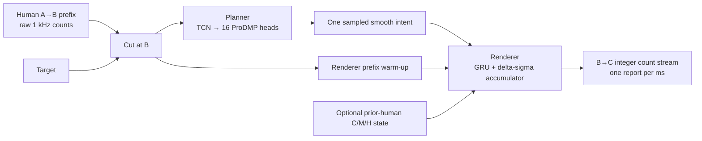
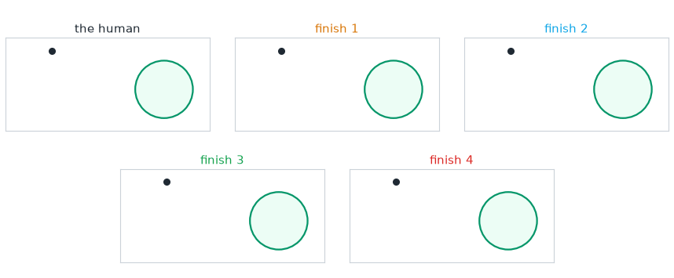
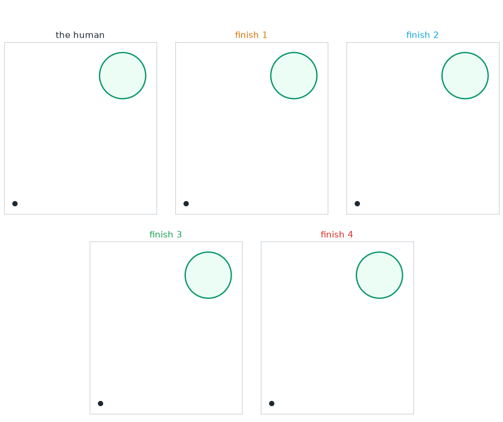

<p align="center">
  
</p>

<p align="center">
  A person starts aiming at a target. ABCurves watches the first part of the movement,
  then finishes it the way that person might have finished it themselves.
</p>

<p align="center">
  <a href="https://optima-manent.github.io/ABCurves/"><b>▶ Live demo</b></a> ·
  <a href="docs/DETECTION.md">Detection study</a> ·
  <a href="docs/TRAINING_AND_INFERENCE.md">Train &amp; run</a> ·
  <a href="docs/DATASET.md">Dataset</a> ·
  <a href="https://discord.gg/Nyf272vUjz">Discord</a>
</p>

<p align="center">
  <a href="LICENSE"></a>
  
  
  <a href="https://optima-manent.github.io/ABCurves/"></a>
</p>

---

## The short version

A mouse movement is a small time series. Roughly every millisecond, the mouse reports
two integers telling the computer how far it just moved. A fast flick, a slow drag,
and the tiny correction before a click are each a few hundred of these reports in a
row.

The first goal of ABCurves was to generate a stream that looked human. That is already
a surprisingly deep problem. A smooth line is not enough. Real movement has changing
speed, small corrections, pauses, bursts, and the quantized rhythm of real hardware.

But looking like *some* human was never the most interesting goal.

**The real goal is to continue a movement so that the result looks like the same
human who started it.** ABCurves watches the real beginning, reads how that person is
moving, and generates only the finish. It produces both the shape of the curve and
the raw 1&nbsp;kHz packet stream a mouse would actually send.

Roughly 100 people contributed recordings from their own hands, mice and computers
to make this release possible. The repository contains the final frozen
models, the training code, the fast streaming runtime, the dataset builder, and the
tests I used to challenge the result.

---

## The idea behind A → B → C

The common way to approach this problem is to choose a start point A and a target C,
then generate the whole movement between them. I think that is the wrong problem.

ABCurves solves this version instead:

> The human starts the movement. We watch them travel from A toward the target, cut
> at a point B, and generate only the finish from B to C.

<p align="center">
  
</p>

The point is not that generating half a movement is half the work. **The first half
is information.** Every hand, mouse, sensitivity setting, and setup behaves a
little differently. A generator that starts from nothing has to invent all of that.
It has to guess whose hand this is, how quickly they move, and what kind of finish
would follow.

A real A→B prefix addresses all those issues. If the person begins with a fast flick,
the finish should end like a flick. If they are making a slow, careful adjustment,
it should land like one. The model can see the speed, direction, style, and packet
rhythm that are already there and continue them.

That is the leap from producing something that merely looks human to producing
something that looks like **your human movement**.

---

## One problem, two models

The shape of a movement and the millisecond texture of a mouse are very different
signals. Trying to make one small real-time model learn both at once blurred them
together, so ABCurves splits the problem in two subproblems.

1. **The Planner** reads A→B and the target, then chooses a smooth B→C finish. It
   decides the path, speed, duration, and landing.
2. **The Renderer** takes that plan and turns it into the integer reports of a real
   mouse. It adds the bursts, gaps, and hardware texture without losing the path.

Here is the whole system at a glance:



The models are small enough to run while the movement is happening. The final
Planner has 369,904 parameters and the Renderer has 80,378. There are two complete
model pairs, seed 7 and seed 23, so the final result can be checked against an
independent training run rather than one lucky checkpoint.

### The Planner learns the whole curve

Predicting a new dx and dy hundreds of times in a row is a poor way to plan a
movement. Every step is free to drift, and the average of many valid human finishes
usually becomes a dull straight line that nobody actually drew.

The Planner instead describes a whole finish with a compact movement primitive
called **ProDMP**. Its starting position and velocity come directly from the human at
B, so the generated curve leaves the cut in the direction the hand was already
travelling. The model only has to predict the bend, rhythm, landing, and duration.

```text
y(t) = c₁(t) · y_B + c₂(t) · ẏ_B + basis(t) · w
```

There is another important problem. The same person can begin two nearly identical
movements and finish them differently. Both finishes may be perfectly human. If the
model is punished whenever it does not copy the single recorded answer, it learns to
average all those possibilities together.

<p align="center">
  
</p>

The final Planner keeps sixteen possible answers instead. During training, the answer
closest to the real finish learns the most from that example. Over time, the sixteen
heads spread across the different ways people naturally complete a movement. At
runtime, ABCurves simply samples one of them.

<p align="center">
  
</p>
<p align="center">
  
</p>

### The Renderer makes it look like hardware

Obviously no mouse emits the smooth floating-point curves above. Real mouse reports are mostly
small integers, often zeros, followed by short bursts of movement. Their timing and
texture depend on the mouse, the hand, and the speed of the movement.

<p align="center">
  
</p>

The Renderer learns that rhythm. A small accumulator keeps track of the smooth motion
that has not yet become an integer report, so no distance quietly disappears through
rounding. A GRU decides when the mouse should emit and which nearby integer packet
fits that moment.

Before generating anything, the Renderer reads the last part of the real A→B stream.
That lets the cadence continue across B instead of suddenly changing when ABCurves
takes over. If enough earlier human movements from the same uninterrupted run are
available, a tiny optional adapter can also learn a little more about that run's
texture. It never learns from generated movement and it never uses the future of the
movement it is currently finishing.

---

## What did the measurements show?

This was the part of the project I was most invested in. Looking at curves is
useful, but eventually I wanted an answer I could measure. Does ABCurves only fall
somewhere inside the huge category of “human-like,” or does it really stay close to
the person whose movement it continued?

### 1. How human is ABCurves?

I measured 49 parts of movement shape and hardware texture, then compared their
distributions. A smaller distance means the two sets of movements behave more alike.

| What is being compared? | Distance |
|---|---:|
| Two parts of the same real session | **0.272** |
| **ABCurves and the human session it continued** | **0.290** |
| The same person in another session | **0.295** |
| The closest different person or setup | **0.291** |
| The average different person or setup | **0.496** |

The first row tells us how much difference appears even when real data is compared
with more real data from the same session. It is the closest practical baseline we
can measure.

**ABCurves scores 0.290. That is only 6.64% above the 0.272 same-session baseline.**
It is also right beside the 0.295 distance between different sessions from the same
person. In fact, ABCurves is a hair closer to its matching human than even the closest
different person or setup in this test, at 0.291. The average distance to somebody
else is much larger at 0.496.

All of this is to say that **the generated movement stays inside
the natural variation around the human it is continuing.** It is not merely landing
somewhere in the broad space of movements that look human.

These comparisons know which recordings belong together. They are evidence of
similarity, not a detector. For the detector, I asked a harder and more useful
question.

### 2. Can it be detected without knowing the person first?

Imagine a completely new person arrives. The detector has never seen that person's
movement before, not even in another session. It must decide whether the new curves
are human while avoiding the far more serious mistake of accusing real human
movement.

That is how the unknown-person test in this repository works. When one person is
tested, every session attached to them is hidden while the detector is built. Its
accusation line is set using other real humans only. Generated results cannot
influence where that line goes.

**Under those conditions, I could not find a useful detector that caught the final
ABCurves output without also producing human false positives.** The judge using all
49 measurements falsely marked one of the six completely unseen people or setups,
yet caught none of the final ABCurves groups. The stricter rules that avoided every
human false alarm also caught none.

This is the result I find most meaningful. Human movement varies enormously from one
person and setup to another. ABCurves uses A→B to stay inside that variation, close
to the person it is modelling. Without knowing that person beforehand, the small
differences left by generation are not a dependable boundary between “human” and
“generated.”

Across the people and judges tested in this release, that is the result. The full
study, exact safeguards, and reproducible commands are in
[`docs/DETECTION.md`](docs/DETECTION.md).

---

## Try it

```bash
git clone https://github.com/optima-manent/ABCurves.git
cd ABCurves
python -m pip install -e .
python examples/quickstart.py
```

The high-level API loads the bundled models and returns a raw integer B→C stream:

```python
from abcurves import Pipeline

with Pipeline.from_pretrained() as pipeline:
    counts = pipeline.generate(
        prefix_raw_dxdy,                 # [P, 2] raw 1 kHz reports from A to B
        target_rel_at_B=(140.0, -22.0), # target centre relative to the cursor at B
        target_radius=18.0,
        progress_center=0.72,
        seed=2026,
    )

counts.dtype  # int16
counts.shape  # (duration_ms, 2)
```

For a live application, [`examples/streaming.py`](examples/streaming.py) shows the
complete loop. The prefix can be prepared on a worker as soon as B is known, then the
stream returns one `[dx, dy]` report at a time.

On the CPU used for this release, a warmed movement was ready to stream in **0.588
ms at the median and 0.820 ms at p99**. Later Renderer steps took **9.5 µs at the
median and 15.0 µs at p99**, comfortably inside a 1&nbsp;kHz budget. These are model
runtime numbers, so USB, firmware, operating-system scheduling, and the final output
layer are not included. Run [`examples/benchmark_runtime.py`](examples/benchmark_runtime.py)
to measure your own machine.

---

## The live demo

The **[live demo](https://optima-manent.github.io/ABCurves/)** places the real human
finish beside several ABCurves finishes. It also shows why the average solution fails
and lets you inspect the raw 1&nbsp;kHz reports. This is still the easiest way to
understand the project.

---

## Train it on your own data

The public preprocessing tool turns validated Capture exports, or an equivalent
portable NPZ file, into the two datasets the models actually need. The Planner learns
from several carefully chosen hand-off points. The Renderer gets one clean example at
the normal 80% hand-off from each physical movement, so one recording cannot outweigh
everyone else simply by producing more training rows.

```bash
python -m pip install -e ".[data]"

python tools/prepare_dataset.py \
  <validated-export-root-or-events.npz> prepared \
  --config configs/final_v2.json --branch both

python training/train_planner.py \
  --train prepared/planner_train.npz \
  --val prepared/planner_val.npz \
  --out runs/planner_retrained.pt

python training/train_renderer.py \
  --train prepared/renderer_train.npz \
  --out runs/renderer_retrained.pt
```

These commands write fresh training checkpoints. They do not silently replace the
verified bundled models. A custom runtime bundle also needs a matching adapter and a
new integrity manifest, as explained in the technical guide.

Every filter has a reason and every rejected event gets an audit trail. The friendly
walkthrough is in [`docs/DATASET.md`](docs/DATASET.md). The exact training recipe,
live A and B rules, model inputs, and streaming contract are in
[`docs/TRAINING_AND_INFERENCE.md`](docs/TRAINING_AND_INFERENCE.md).

---

## What is in the repository?

```text
abcurves/
  pipeline.py          the load-once generation and streaming API
  seam.py              finds A and B from the live movement
  planner.py           predicts the shape, timing, and landing
  renderer.py          turns the smooth plan into mouse reports
  preprocessing.py     builds the final Planner and Renderer datasets
  judges.py            detection and similarity measurements

models/                 final seed-7 and seed-23 models with verified hashes
training/               Planner and Renderer training programs
evaluation/             similarity measurements and detector experiments
results/                compact result files and runtime measurements
examples/               quick start, streaming, benchmark, and sample data
docs/                   live demo and the deeper guides
tests/                  model, runtime, data, seam, and evaluation checks
```

The smaller example dataset is included so inference, descriptor building, and the
smoke tests can run straight away. It demonstrates the format and the method, but it
is not the full contributed hardware corpus used for the final measurements.

---

## The people who made this possible

Roughly 100 people took time out of their day to run ABCurves Capture and share real
sessions from their own hands, mice, computers, and settings. That data made it
possible to move beyond “this looks convincing” and actually test the idea across
real hardware and real human variation.

Thank you, and know that this release exists because of you :)

The full movement corpus is not bundled yet. It is valuable, still growing, and
deserves careful handling. If you want to work with it, join the
**[Discord](https://discord.gg/Nyf272vUjz)** and contribute a Capture session.
Contributors can request research access, and the intention is to publish the full
corpus for everyone later.

---

## Acknowledgements and citation

The Planner's movement representation builds on **ProDMP**:

> Ge Li, Zeqi Jin, Michael Volpp, Fabian Otto, Rudolf Lioutikov, Gerhard Neumann.
> *ProDMP: A Unified Perspective on Dynamic and Probabilistic Movement Primitives.*
> arXiv:2210.01531, 2022. <https://arxiv.org/abs/2210.01531>

If ABCurves helps your work, cite this repository:

```bibtex
@software{abcurves,
  title  = {ABCurves: Real-Time Human-Conditioned Mouse-Motion Continuation},
  author = {Optima Manent},
  year   = {2026},
  url    = {https://github.com/optima-manent/ABCurves}
}
```

Released under the [MIT License](LICENSE).

---

<p align="center"><sub>
  A mouse movement is a small time series, and finishing one like a human
  turned out to be a deeper problem than it looks.
</sub></p>

---

## Support the project

Many people have kindly asked if they can support my work financially. ABCurves
will always stay free and open source as it was built for the community, with the help
of the community, and that will never change.

If you still insist, you can **[support my work here](https://github.com/sponsors/optima-manent?frequency=one-time)**.
It helps cover a little of the hundreds of hours that went into ABCurves. And thank you, it genuinely means a lot. :)
