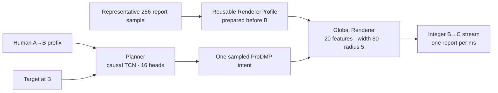

# Training and running ABCurves

ABCurves finishes a movement that a person has already started.

The person moves from **A** toward a target. At **B**, ABCurves takes over and
generates B→C. The Planner chooses a smooth finish. The global Renderer turns that
intent into one signed integer `dx, dy` report per millisecond.



This guide begins with the release API, then explains the causal A/B seam, the two
models, training, checkpoint selection, and the native deployment contract. Dataset
construction is documented separately in [DATASET.md](DATASET.md).

## Install and run the finished pipeline

Python 3.10 or newer is required. From the repository root:

```bash
python -m venv .venv

# Windows PowerShell
.\.venv\Scripts\Activate.ps1

# macOS or Linux instead
# source .venv/bin/activate

python -m pip install -e ".[all,dev]"
```

The Planner runs on CPU. The Windows release includes the native Renderer library.
On macOS or Linux, build the C99 library before the first run:

```bash
cmake -S runtime/c -B runtime/c/build
cmake --build runtime/c/build --config Release
ctest --test-dir runtime/c/build -C Release --output-on-failure
```

The Python binding also accepts an explicit `renderer_library=` path, or the
`ABCURVES_RENDERER_LIBRARY` environment variable.

Now the same checks work on every supported host:

```bash
python examples/quickstart.py
python examples/streaming.py
python -m pytest
```

## The shortest complete Python example

The Planner prefix is event-specific. The Renderer profile is not: prepare one
representative texture sample before a latency-sensitive B handoff and reuse it:

```python
import numpy as np
from abcurves import Pipeline

# Causal A→B movement used by the Planner.
planner_prefix = np.asarray(prefix_raw_dxdy, dtype=np.float32)

# Exactly 256 chronological physical reports from a representative recording.
profile_window = np.asarray(representative_256_raw_reports, dtype=np.int16)
assert profile_window.shape == (256, 2)

with Pipeline.from_pretrained() as pipeline:
    renderer_profile = pipeline.prepare_renderer_profile(profile_window)
    counts = pipeline.generate(
        planner_prefix,
        renderer_profile=renderer_profile,
        target_rel_at_B=(140.0, -22.0),
        target_radius=18.0,
        progress_center=0.74,
        seed=2026,
    )

print(counts.shape, counts.dtype)  # (duration_ms, 2), int16
```

Profile preparation accepts exactly `(256, 2)` finite integer reports. There is no
implicit truncation or padding: select the representative chronological window in
the caller, where its provenance is known. The window need not end at B. An
indicative one-draw Renderer-only engineering probe found little practical dependence
on millisecond-perfect alignment, with overlapping uncertainty intervals; it is not
a promotion or equivalence result. Its scope and measurements are recorded in the
[`Renderer profile sensitivity receipt`](../results/inference/renderer_profile_sensitivity.json).
Preparing the profile ahead also keeps its replay off the handoff-critical path.

Keep the returned `RendererProfile` and pass it to any number of independent events.
Prepare a replacement between events only when the physical device or setup changes
materially. Changing the event seed, not rotating the profile on a timer, is the
normal source of output variation.

The compact fixture in `examples/quickstart.py` has no separate representative
recording, so its example profile declares quiet history before the shorter prefix.
That is a demo convention. A real application should prepare a genuine sample from
the device or setup it intends to use.

### What each input means

Everything is measured in **raw mouse counts**, before desktop sensitivity or
cursor acceleration.

- `planner_prefix` is the real A→B recording. It is a finite `(P, 2)` array with one
  closed 1 ms bin per row; the final row ends at B.
- `profile_window` is exactly 256 finite, integer-valued physical reports from a
  representative 1 kHz recording. Values must fit signed int16. The Planner supplies
  the event-specific smooth-intent boundary; the profile supplies Renderer packet
  state such as previous emission, last smooth motion, run state, and recent activity.
  It is not a user identity.
- `target_rel_at_B=(x, y)` is the target centre relative to the cursor at B, in raw
  count space.
- `target_radius` is a positive radius in the same space.
- `progress_center` is progress from A toward the target centre. Use the value from
  the causal B trigger, not edge progress.

All three geometry fields are required at every Planner entry point. Passing zero as
"unknown" is not neutral: radius, target distance, and progress are learned summary
features and materially change the predicted finish.

Do not mix pixels and raw counts. Do not interpolate or smooth the observed reports.
If hardware reports faster or slower than 1 kHz, first accumulate them causally into
closed 1 ms bins. That is the timebase the release learned.

The event `seed` makes both Planner-head choice and Renderer sampling repeatable. A
different seed requests another sample; it does not generate several candidates and
pick the nicest one. Renderer randomness is counter-based and local to the event, so
another request cannot disturb it through process-global random state.

## Streaming one report at a time

Create one `Pipeline` when the process starts and keep it alive. Prepare the Renderer
profile before B; the B-time path then only freezes the Planner prefix and clones the
already prepared profile state:

```python
with Pipeline.from_pretrained(prewarm=True) as pipeline:
    renderer_profile = pipeline.prepare_renderer_profile(profile_window)

    # Later, when the causal trigger fires:
    pending = pipeline.begin_at_b(planner_prefix, renderer_profile=renderer_profile)

    stream = pending.finish(
        target_rel_at_B=target_rel_at_B,
        target_radius=target_radius,
        progress_center=progress_center,
        planner_seed=event_seed,
        renderer_event_seed_u64=event_seed,
    )

    while not stream.complete:
        dx, dy = stream.step()
        send_one_1khz_report(int(dx), int(dy))
```

`prepare_renderer_profile()` validates and owns the 256-report input, then prepares
one immutable template. `begin_at_b()` copies the Planner prefix. `finish()` samples
one Planner head, clones the profile into independent event state, starts the
Renderer, and returns a stream that owns that event state.

Each `PendingB` can be finished once. A `RendererProfile` may be reused by independent
events from the same `Pipeline`; a `PreparedStream` may not. Applications must not
race `Pipeline.close()` with active calls. Use `render_remaining()` when a complete
array is more convenient than per-tick output.

`prewarm=True` is the default, as is one Torch CPU thread. Prewarming pays for model
loading, ProDMP caches, compiled Planner kernels, the native model view, and worker
startup once. Creating a new `Pipeline` for every movement discards that work.

### What the runtime does not own

ABCurves emits signed integer reports. It does not open a USB device or schedule HID
polls. Firmware, permissions, operating-system scheduling, queues, synchronization,
and final output are caller-owned. Benchmark those layers in the real application.

The recommended native handoff is deliberately small: prepare exactly 256
representative reports before B, copy that prepared profile for an event, then begin
once. There is no continuously running observer and no timing-dependent rolling
state. `renderer_context_raw_dxdy=` remains available for exact per-event evaluation
and compatibility; because it replays its 256 reports at B, it is not the recommended
latency-sensitive path.

## Finding A and B without looking ahead

The helpers in [`abcurves/seam.py`](../abcurves/seam.py) make decisions only from
reports that have already arrived. Feed `OnsetDetector` and `BTrigger` once per
closed 1 ms bin.

### Finding A

A is the estimated beginning of purposeful target-directed motion. After 12 moving,
target-aligned bins confirm the movement, A is placed four bins before that run
began. This moves A closer to the true onset without pretending it was known at the
time.

| Setting | Release value |
| --- | ---: |
| Quiet/noise window | 24 ms |
| Speed threshold | `max(0.35, median + 6 × MAD)` counts/ms |
| Minimum target-alignment cosine | 0.15 |
| Consecutive qualifying bins | 12 |
| Backtrack before confirmed run | 4 ms |

If capture starts after the hand is already moving, the quiet estimate can be
contaminated. When its median already exceeds `0.35`, the detector falls back to the
fixed floor so a bad baseline cannot hide A.

Keep a short ring buffer. `OnsetEvent.index` points to the earlier estimated A, not
the later tick on which the detector gained enough evidence to confirm it.

### Choosing B

After A, arm `BTrigger` with the target vector and radius. B fires at 80% of progress
toward the **near edge of the target**, while the cursor remains outside and enough
movement remains to generate.

The handoff is accepted only when:

- at least 8 counts remain;
- centre progress is at most 0.92;
- A→B is at most 1,500 ms; and
- progress has not regressed by more than 0.18.

The 24 ms minimum prefix and 12 ms minimum future are offline training eligibility
rules. A live trigger cannot inspect a future that has not happened.

`BFire.progress_edge` explains why the trigger fired. Pass
`BFire.progress_center` to the Planner. They differ most when the target is large.
If no valid B appears, leave the movement to the person or the application's normal
fallback. Moving B later in secret creates a different system.

## What the Planner learns

The Planner does not guess hundreds of future reports one by one. Instead it predicts
a compact smooth movement with ProDMP. Position and velocity at B are built into the
representation, so the curve begins from the motion the person was already making.
Forty-two values describe both axes and one describes duration.

The same beginning can have several legitimate endings. The Planner keeps sixteen
heads and trains them with relaxed winner-takes-all. The head closest to the recorded
finish gets most of the loss while the others get a small share so they remain
useful. At runtime, one head is sampled uniformly. There is no ensemble, best-of-K
search, or reranking.

### Planner architecture

| Part | Release setting |
| --- | --- |
| Input prefix | Last 160 raw 1 ms bins plus validity |
| Extra context | 62 causal movement and target summaries |
| Network | Width-96 causal TCN, 3 temporal blocks, dropout 0.15 |
| Output | 16 heads × 43 values |
| ProDMP | 20 forcing bases plus learned goal, alpha 25, phase alpha 3, ridge `1e-3` |
| Maximum future | 1,000 ms |
| Learned parameters | 369,904 |
| Selected checkpoint | Terminal epoch 260 |

`planner_head=` exists for inspection and tests. Uniform random head selection is the
release rule.

### Planner examples

Training requests 21 nearby edge-progress handoffs:

- 0.78 through 0.90 for shorter edge distances;
- 0.78 through 0.92 for longer movements; and
- fixed 0.80 for validation and non-training splits.

Cuts landing on the same millisecond are deduplicated. At each epoch, one cut is
chosen per physical source through a deterministic shuffled cycle. Every movement
therefore has total weight one even if it supplies many candidate handoffs or
controlled small-target rows.

The selected Planner training set contained 21,302 physical sources per epoch. Over
260 epochs, that is 5,538,520 source-level presentations.

### Planner optimizer and loss

| Part | Release setting |
| --- | --- |
| Optimizer | AdamW |
| Learning rate / weight decay | `1e-3` / `1e-4` |
| Batch size / gradient clip | 128 / 5.0 |
| Training length | 260 epochs; terminal epoch exported |

The loss covers endpoint, path, speed, duration, initial direction, and excessive
turning with weights `1.0 / 0.6 / 0.5 / 0.75 / 0.8 / 0.3`.

The turning guard uses duration-conditioned p95 limits fitted from human training
movement. The stored limits for `<150 / 150–250 / ≥250 ms` are
`0.381892 / 0.838709 / 0.708528`.

RWTA begins with epsilon `0.50`, anneals over 45 intervals, and stays at `0.05` from
epoch 46 through 260:

```text
epsilon(epoch) = 0.50 + (0.05 - 0.50) × min(1, (epoch - 1) / 45)
```

Train the two Planner replications independently:

```bash
python training/train_planner.py \
  --train prepared/planner_train.npz --val prepared/planner_val.npz \
  --out runs/planner_seed7.pt --epochs 260 --wta-anneal-epochs 45 \
  --heads 16 --seed 7 --device cuda

python training/train_planner.py \
  --train prepared/planner_train.npz --val prepared/planner_val.npz \
  --out runs/planner_seed23.pt --epochs 260 --wta-anneal-epochs 45 \
  --heads 16 --seed 23 --device cuda
```

The one-cut-per-source schedule and terminal-epoch export are the trainer's single
recipe rather than optional switches. The trainer refuses to overwrite an existing
checkpoint.

## What the global Renderer learns

The Planner's curve is deliberately smooth. A mouse is not. A real 1 kHz stream
contains zeros, integer bursts, quantization, sign changes, skipped polls at speed,
and short-range correlations.

The Renderer learns a general conversion from smooth intent to this texture. It is
not trained only on B→C crops. Its source is the entire dense physical session:

```text
before A | A→B | B→C | after C | between events | idle and unrelated movement
```

The builder cuts that stream blindly into non-overlapping `[256 | 800]` windows. It
does not read A, B, C, targets, successes, or event outcomes. This is what makes the
model global: the texture law is learned independently of one task phase.

### Self-supervised teachers

For each presentation, the trainer randomly selects a triangular moving-average
teacher with window 3 or window 5. The smoothed stream is the intent; the original
integer packets are the answer. No manual texture labels are required.

Within each training window, all 256 observed reports define the five regime
summaries and the learned recurrent boundary. The float training reference warms its
recurrence on the most recent 128 reports. The packed runtime still processes all 256
when a profile is prepared; its rank-16 handoff maps that observation to the
canonical recurrent boundary. The number 128 therefore does not relax the 256-report
profile contract. Deployment may reuse one prepared profile across events; that does
not alter how the model was trained.

Observed context receives zero loss. Loss begins only on the 800 future reports. The
model therefore learns to condition on physical report texture and then render a
future plan. Deployment prepares that conditioning state ahead of the event.

### Architecture and features

The float reference has one width-80 GRU, an emit head, and a 121-class joint offset
head covering `[-5, 5] × [-5, 5]`. It has **34,362 learned scalars**.

Its 20 phase-free inputs are:

| Group | Features |
| --- | --- |
| Smooth kinematics | scaled speed, acceleration, curvature, tangent x/y |
| Accumulator in movement frame | tangent and normal debt |
| Previous reports | previous emit tangent/normal, last nonzero tangent/normal |
| Cadence state | active/quiet run, normalized run length, recent zero rate, `log1p(speed)` |
| 256-report regime | active rate, active-magnitude mean and p95, sign-flip rate, high-frequency power |

There is no event phase input. The model does not need to know whether a tick is
before A or after C.

### The accumulator

A hysteretic delta-sigma accumulator integrates smooth intent. When an integer report
is emitted, that amount is reclaimed from the accumulator. Fractional movement is
therefore remembered instead of lost independently at every tick.

The release does **not** promise exact endpoint equality on every sampled stream.
Offsets and finite endings can leave residual debt. The contract is that this debt is
tracked, small, and bounded, with a safety release at magnitude 32 and an
exact-zero/no-debt gate that keeps true zero intent silent.

### Sampling calibration

The deployed artifact freezes these values:

| Control | Value |
| --- | ---: |
| Emit-logit bias | 1.5 |
| Emit temperature | 1.3 |
| Offset-magnitude temperature | 0.75 |
| Offset-direction temperature | 0.15 |
| Axis hysteresis | 0.5 |
| Accumulator safety release | 32 |
| Offset radius | 5 counts per axis |
| Maximum output | signed int16 API; each emitted axis clamped to `+/-127` |
| Lateral-offset penalty | AF1.5, always enabled |

AF1.5 is a soft safeguard for rare implausible sideways spikes. It penalizes offset
mass with the exact law
`offset_logit -= 1.5 * max(abs(offset dot normal) - 1 count, 0)`. It does not change
the smooth plan. The released C runtime bakes it in; an evaluation that omits it is
evaluating a sampler that does not ship.

Quiet intent is gated only when float intent is at most `1e-7` in magnitude (exact
zero in the Q16 API) and both accumulator-debt axes are below `0.5` count. The
`32`-count safety release is checked first, so accumulated debt cannot be hidden by
the quiet gate.

## Renderer training: presentations, not epochs

The selected P0 training corpus contains 81,737 windows from 54 sessions and 45
users. Validation contains 10,807 windows from 8 sessions and 8 users held out from
Renderer training. It is not automatically a joint Planner-and-Renderer holdout,
because the branches preserve different frozen split salts.

A **presentation** means one source window shown once under one randomly selected
w3/w5 teacher. That is the transferable budget. Epoch labels are not transferable
when corpus size changes.

The transferable reference budget was:

```text
9,858 movements × 12 = 118,296 presentations
```

Carrying the number `12` onto a much larger corpus would multiply the actual work
many times over. The selected global model instead stops at exactly:

```text
118,345 presentations
= 1 complete pass over 81,737 windows
  + 36,608 windows from the next shuffled pass
≈ 1.447875 passes
= 463 optimizer steps at batch size 256
```

Epoch boundaries remain optimizer boundaries. The first P0 pass therefore ends with
a 73-window batch; the next pass contributes 143 full 256-window batches. No batch
mixes the end of one shuffled pass with the beginning of the next.

| Part | Release setting |
| --- | --- |
| Optimizer | Adam |
| Learning rate / weight decay | `2e-3` / `1e-5` |
| Batch size / gradient clip | 256 / 5.0 |
| Weighting | Natural window frequency |
| Teachers | One deterministic w3/w5 choice per source and shuffled pass |
| Recurrent warm-up | Most recent 128 of the 256 observed reports |
| Teacher-label base hysteresis | 1.0 |
| Sampled deployment base hysteresis | 0.5 |
| Loss | Future-only emit BCE + valid joint-offset cross-entropy |
| Budget | 118,345 presentations |

Train the float reference with:

```bash
python training/train_renderer.py \
  --train prepared/renderer_train \
  --val prepared/renderer_val \
  --out runs/renderer_p118345.pt \
  --presentations 118345 --batch-size 256 \
  --seed 7 --device cuda
```

Use `--device cpu` when CUDA is unavailable. The program memory-maps the prepared
arrays, checks whole-user train/validation isolation, records data hashes, and refuses
to overwrite the output.

The resulting float checkpoint is directly usable through the normal Pipeline API:

```python
from abcurves import Pipeline

with Pipeline(
    float_renderer_checkpoint="runs/renderer_p118345.pt",
    float_renderer_device="cuda",  # use "cpu" when needed
) as pipeline:
    renderer_profile = pipeline.prepare_renderer_profile(profile_window)
    counts = pipeline.generate(
        planner_prefix,
        renderer_profile=renderer_profile,
        target_rel_at_B=(140.0, -22.0),
        target_radius=18.0,
        progress_center=0.72,
        seed=2026,
    )
```

This path uses the same 256-report profile shape and AF1.5 sampling law. The profile
object is reusable at the API boundary, but the float backend still replays its raw
window through the float GRU and samples the whole continuation when each event
begins. It is intended for research and ordinary Python use—not as a claim of native
profile-clone latency or embedded validation.

The two hysteresis values are intentionally different stages. `1.0` defines the
offset labels used while fitting the neural law. The later carried-state sampling
calibration selected `0.5`; it changes the sampler, not the checkpoint tensors.

Within shuffled pass `epoch`, `numpy.random.default_rng([seed, epoch])` draws all
w3/w5 choices before it draws the permutation. Rows arrive from preparation in
`(session_id, user_id, window_start_tick)` order. These details, the epoch-tail batch,
and the initialization-compatible discarded GRUCell draw reproduce the selected
optimizer trajectory while keeping only one active recurrent weight set.

### Why ordinary validation loss does not select this model

Teacher-forced loss answers a narrow question: given the real earlier packets, how
well does the network predict the next recorded packet? Deployment asks a harder
question: once sampling starts and the model consumes its own emitted history, does
texture remain right over a carried full session?

Past the useful budget, teacher-forced held-out loss could continue improving while
sampled texture became measurably worse. For that reason:

- validation loss is recorded as a diagnostic;
- it does not choose or early-stop the release checkpoint; and
- promotion uses sampled texture with state carried across held-out full sessions.

This rule is stored in the training report and dataset configuration so a conventional
“lowest validation loss wins” script cannot quietly select a different sampler.

Run the public carried-session selector on each candidate instead:

```bash
python -m evaluation renderer-selection full_sessions/sessions.json \
  --backend float --model runs/renderer_p118345.pt \
  --specs w3 w5 --seed 7001 \
  --output runs/renderer_p118345_selection.json
```

For the shipped fixed-online artifact, omit `--model` and use `--backend native`.
The evaluator hash-checks the full-session sources, takes physical ticks `[0,256)`
once, carries one uninterrupted rollout over every remaining tick, computes
Texture19 on non-overlapping 512-tick segments, and computes packet ratios, false
quiet-gate activation, and net displacement over the full future. It reports the
carried-session `T/R/Z/D/S` user-macro score without exposing source IDs or paths.
`T` is mean standardized Texture19 W1; `R` is the mean absolute log-ratio error for
active fraction, L1/tick, L2/tick, and x-axis sign-flip rate; `Z` is causal
gate-eligible false activation; and `D` is session-equal relative net error. The
evaluator invents no epsilon: undefined ratios or no eligible quiet ticks invalidate
the score.

The command makes the selection rule executable on a local panel. It cannot recreate
the checked-in eight-session numbers without those private sessions, nor can it prove that a
new panel's users were absent from model development. Compare candidates only on the
same hash-bound panel, specs, seed, and backend contract. One invocation scores one
artifact and one draw seed; it does not automatically reproduce the frozen two
model seeds by two smoothing views by two draw seeds hierarchy. Run and retain each
cell separately before applying that frozen aggregation.

### Why the full corpus was retained

A pruned R03 alternative scored `S=1.2723731`; full P0 scored `1.2730297`, or
`0.052%` higher/worse on this lower-is-better development score. P0 won 2 of 8
model-seed/smoothing/draw cells and 31 of 64 per-user cell comparisons. Because the
difference was treated as a
practical tie and pruning added another rule, the full 81,737-window corpus was
selected.

This supports one narrow decision: pruning that corpus was unnecessary. It does not
establish a general law that more data must monotonically improve every Renderer.

## From float training to the released artifact

`training/train_renderer.py` writes a float research checkpoint. The deployed file is
a separately authenticated post-training-quantized promotion:

```text
models/renderer_global_h80.bin
  44,484 bytes total
  39,512-byte quantized base
   4,972-byte rank-16 prefix handoff
```

The release also ships
[`renderer_global_h80_float.pt`](../models/renderer_global_h80_float.pt), a sanitized
20-feature checkpoint containing the 34,362 learned scalars behind the selected
artifact. It removes the zero phase column, duplicate compatibility GRUCell,
workstation paths, and per-user research history. Its SHA-256, active-tensor digest,
and selected source-container digest are recorded in the model manifest. Load it
through the authenticated research resolver:

```python
from abcurves.model_store import resolve_renderer_float
from abcurves.renderer import load_count_model

float_model, float_report = load_count_model(resolve_renderer_float())
```

The rank-16 handoff maps one observed 256-report sample into the initial recurrent
state stored by the reusable runtime profile. Despite the convenient API name,
`RendererProfile` carries no user identity and is not a personalization adapter.

The artifact SHA-256 is:

```text
8fea217f76c3f501dab9576cbac5cd26970d30d01eedb95da3ca3946a0f52f8b
```

### Promotion fidelity

The promotion test uses a frozen eight-session/eight-user carried-session development panel;
it contains 11,414,503 future ticks and 22,291 scored segments. It is explicitly a
non-protected development panel, not a final untouched-user test.

The lower-is-better promotion score is

```text
S = Texture19_W1 / 0.05
  + packet_ratio_error / log(1.05)
  + false_zero_activation / 0.001
  + relative_session_net_displacement_error / 0.01
```

`packet_ratio_error` is the mean absolute log-ratio error for active fraction, L1
and L2 packet rates, and the x-axis sign-flip rate. The cited component values are
user-macro within one frozen cell: model-training seed 7, W5 smoothing and Renderer
draw seed 7001. On that cell, the final fixed-online artifact had `S=1.4328467`; the
source float model had `S=1.4311797`. Promotion therefore changed the score by
`+0.11648%`. The corpus-selection study aggregated a wider route/seed/draw
hierarchy; this compact promotion receipt does not claim to reproduce that hierarchy.

A different check isolates the online handoff rather than quantization. Against the
same fixed model initialized by the reference warm replay, only 8 of 22,829,006 scalar
output components differed, and every difference was one count. These two tests
answer different questions and must not be merged into one “exact quantization”
claim.

The compact public
[`renderer_promotion.json`](../results/inference/renderer_promotion.json)
binds the formula, panel size, scope, artifact and source hashes, component values,
and sealed research-receipt digest. The raw panel sessions are not redistributed; the
receipt is auditable evidence, while the public carried-session scorer can be run on
a correctly structured local corpus.

The Python loader checks both file size and hash before the C runtime checks its
internal format, CRC, and source identity. Training a float checkpoint does not
silently replace this file. A newly promoted artifact needs its own quantization
validation, cross-language differential tests, manifest entry, and release audit.

## Native C99 contract

The portable runtime lives in [`runtime/c`](../runtime/c). Prepare a profile outside
the B-critical path, keep that template unchanged, and copy it for every event:

```c
int status = abc_online_model_init(&model, blob, blob_bytes);
if (status != ABC_FIXED_OK) return status;
status = abc_online_reset(&profile, &model);
if (status != ABC_FIXED_OK) return status;

for (size_t i = 0; i < 256; ++i) {
    status = abc_online_observe_raw(&profile, sample[i].dx, sample[i].dy);
    if (status != ABC_FIXED_OK) return status;
}

/* At B: copy the prepared template; never begin on the template itself. */
renderer = profile;
status = abc_online_begin(&renderer, event_seed);
if (status != ABC_FIXED_OK) return status;

for (size_t t = 0; t < duration; ++t) {
    status = abc_online_step(
        &renderer, smooth_x_q16[t], smooth_y_q16[t], &report
    );
    if (status != ABC_FIXED_OK) return status;
    send_report(report.dx, report.dy);
}
```

All status codes must be checked. `abc_online_begin()` fails unless the copied state
contains exactly 256 observations. Smooth intent uses signed Q16 deltas. The sample
must contain chronological physical reports, but it does not need to end at B.

The library allocates no heap. Callers retain the model view and the prepared profile
for as long as any copy refers to them. Copy only the fully prepared template, create
one independent state per event, and never overwrite an active event with a refreshed
profile. A new profile can be prepared off-path and selected between events.

| Native quantity | Release value |
| --- | ---: |
| Model image | 44,484 bytes |
| Model view | 208 bytes on validated Windows x64 ABI |
| Prepared profile or active-event state | 5,088 bytes each on validated Windows x64 ABI |
| Generated-tick hot work | 33,760 int8 multiply-accumulates |

The image size and MAC count are platform-independent. Structure sizes depend on
compiler alignment and pointer width; firmware ports should call
`abc_online_model_size()` and `abc_online_renderer_size()` on the target ABI. Keeping
one profile and one active event requires two Renderer-state objects.

The hot GRU path is fixed-point/int8. Context observation, regime statistics, and the
rank-16 handoff still use float/double and math-library operations. The code is
functionally portable to small C targets and is a concrete ESP32 starting point, but
it has not been timed or certified on ESP32 hardware.

The artifact and C/Python behavior were checked across the release toolchains,
including optimized builds and undefined-behavior instrumentation. Repeat those
checks for a new compiler, architecture, or promoted artifact.

## Performance measurements

On the Windows x64 machine used for the native release microbenchmark:

| Operation | p99 |
| --- | ---: |
| Prepare all 256 profile reports off-path | 3,629.5 µs |
| Observe one physical profile report | 14.3 µs |
| Copy the profile and begin | 8.1 µs |
| Generate one report | 23.4 µs |

Profile preparation comprises 256 observations and is completed before B. The
latency-sensitive event path copies the prepared state and begins from that copy.
These warmed measurements describe the native Renderer core on that machine and
include timer overhead. They are not ESP32 results and do not include the Planner,
USB, HID scheduling, application queues, or operating-system jitter. The published
receipt records the host, compiler, timer, and sample counts:
[`native_renderer_windows_x64.json`](../results/inference/native_renderer_windows_x64.json).

The composed warmed Python benchmark on the same host measured B→stream-ready at
239.85 µs median / 433.517 µs p99 and B→first report at 275.8 µs median /
546.751 µs p99. Those values include the Planner and native profile clone but exclude
the off-path profile preparation, USB/HID transport, and application scheduling. The
checked-in [`composed benchmark receipt`](../results/inference/benchmark_this_machine.json)
records the full phase breakdown and limitations; it is a host measurement, not a
hard real-time guarantee.

Rebuild, test, and reproduce it with:

```bash
cmake -S runtime/c -B runtime/c/build
cmake --build runtime/c/build --config Release
ctest --test-dir runtime/c/build -C Release --output-on-failure
runtime/c/build/Release/abc_renderer_benchmark.exe \
  models/renderer_global_h80.bin native_renderer_local.json 128
```

With a single-config Unix generator, the benchmark is normally at
`runtime/c/build/abc_renderer_benchmark` instead of the `Release` subdirectory and
has no `.exe` suffix.

Measure the composed Python path locally without overwriting a checked-in receipt:

```bash
python examples/benchmark_runtime.py --trials 200 --out benchmark_local.json
```

## What the model seed controls

The release contains two independently trained Planners and one shared selected
Renderer:

```python
with Pipeline(model_seed=7) as default:
    pass

with Pipeline(model_seed=23) as planner_replication:
    pass
```

`model_seed` selects Planner weights. The event `seed` selects a Planner head and
Renderer random stream for one movement. Neither setting forms an ensemble or runs a
best-of-many search.

The exact files and integrity rules are in
[`models/README.md`](../models/README.md).

## Practical rules worth preserving

- Keep geometry in raw count space and time on closed 1 ms bins.
- Keep A and B causal; do not substitute edge progress for centre progress.
- Split people before fitting normalizers, models, or judges.
- Give each physical Planner source total weight one across its candidate cuts.
- Sample one Planner head without reranking.
- Train the Renderer on uninterrupted sessions, not reconstructed event crops.
- Preserve blind non-overlapping `[256 | 800]` Renderer windows and drop only the
  incomplete tail.
- Count Renderer work in presentations, not copied epoch labels.
- Treat teacher-forced loss as diagnostic and select on sampled carried texture.
- Prepare a reusable profile from exactly 256 genuine chronological reports before
  B; never depend on implicit slicing or padding.
- Clone the prepared native profile for each event. Do not rotate it on a timer or
  treat it as a user identity.
- Keep AF1.5 enabled anywhere claiming to reproduce the deployed sampler.
- Evaluate the composed Planner→Renderer output, because that is what users run.
- Measure USB and application integration separately from native-core timing.

Detection results and their separate evaluation safeguards are in the
top-level [DETECTION.md](../DETECTION.md).
