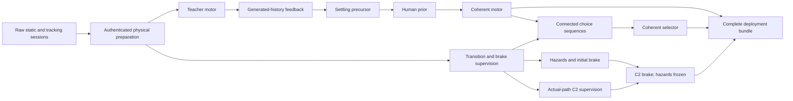

# Training and exporting ABCurves

Start with the raw session downloads and public Capture tools in
[DATASET.md](DATASET.md). This guide gives the complete selected recipes. Runtime
state, timing, units and examples are in [INTEGRATION.md](INTEGRATION.md).

Install `python -m pip install -e ".[training]"`. The commands below run from the
repository root, use fresh output directories, and assume the dataset guide has
created `prepared/capture-static/` and `prepared/tracking/`. CUDA improves training
speed; `--device cpu` is supported. Runtime versions are in `constraints-tested.txt`. Training/export were checked
with Python 3.13.14, PyTorch 2.12.0+cu130, pandas 3.0.3 and ONNX 1.22.0.

Frozen source manifests identify the selected data for reproduction. New recordings
can use the general preparation tools with their own source selections. Sources,
filters, roles, normalizers, model seeds, sampling seeds and export hashes have
separate identities.

## Continuous Planner: complete dependency chain

The deployed system contains a motor, coherent movement selector, and a component
network containing braking and stop/restart hazards. The accepted policy combines
these components; the final brake alone is insufficient. Its technical selection
identity is B2-23.



### Physical preparation

```powershell
python -m training.continuous.prepare_motor --exports prepared/capture-static/exports/static --original-tracking prepared/tracking/original --new-tracking prepared/tracking/new --output prepared/motor
```

This authenticates 59 static native streams and the complete tracking indices and
episodes. It reconstructs 333,326 late and 170,416 early static cuts from 21,302
physical parents, plus 48,695 original tracking anchors. Source enrollment,
visibility augmentation, rotations, weights and all fifteen cached feature/label
arrays are checked against the selected hashes. Source identity and target timing
are retained alongside motion.

The model uses a 640 ms history, sixteen 128 ms ProDMP proposals, width-96 GRU
encoding, 70×9 coarse inputs, 54 fine inputs and eight dynamics inputs. The final
commitment is 32 ms. Physical features use the selected velocity scale
`1.1982087601807259`, position scale `81.73350722609987`, and 32 ms target secants.
The exact configuration is in the motor checkpoint and deployment manifest.

Base teacher batches contain 64 late-static, 64 early-static and 128 original
tracking examples. Static physical parents cycle through their selected cuts;
tracking sampling retains its person/family/source hierarchy. Rotation and
visibility augmentation have independent seeded streams. Later training adds 64
examples from the new tracking cohort, then takes the selected 160-example subset
of the 320-example teacher batch. The source algorithms and original authority
hashes are retained in `recipes/continuous/`.

### Motor training

| Stage | Model seed | Updates | Learning rate | Purpose |
| --- | ---: | ---: | ---: | --- |
| `teacher` | 7 | 20,000 | 0.0002 | Sixteen-head RWTA motion representation; 64 ms precursor commitment |
| `feedback` | 7 | 3,000 | 0.00005 | 32 ms generated-history rollout and terminal control |
| `settling` | 7 | 3,500 | 0.00002 | Preserve useful motion while learning settling exposure |
| `prior` | 7 | 2,500 | 0.00005 | Later human-motion prior and synthetic quiet exposure |
| `motor` | 7 | 600 | 0.00003 | Coherent proposals with generated-history and frozen-prior constraints |

All use AdamW, weight decay 0.0001, betas `(0.9,0.999)`, epsilon `1e-8`, and gradient
norm limit 5. The base stages preserve the original float64 global gradient norm
before float32 scaling. Training uses no mixed precision or TF32. The settling
budget is the original 1,000-update pilot followed by 2,500 further updates with
uninterrupted optimizer/RNG state, not two independently initialized fits.

The teacher uses RWTA position, velocity and acceleration supervision, with the
acceleration term weighted 0.25. Epsilon anneals from 0.20 to 0.05 by halfway through
the teacher budget; feedback retains 0.05, adds generated-history sequences and
static-terminal control weight 4. The final motor retains the exact human-prior,
quiet, rollout and functional-source objectives in `coherence_loss.py`. These
objectives keep purposeful acquisition and motion variation in the same training
trajectory; a single endpoint-error objective was not sufficient.

```powershell
python -m training.continuous.train_motor --stage teacher --data prepared/motor --output runs/teacher
python -m training.continuous.train_motor --stage feedback --data prepared/motor --initial runs/teacher/step_20000.pt --output runs/feedback
python -m training.continuous.train_motor --stage settling --data prepared/motor --initial runs/feedback/step_03000.pt --output runs/settling
python -m training.continuous.train_motor --stage prior --data prepared/motor --initial runs/settling/step_03500.pt --output runs/prior
python -m training.continuous.train_motor --stage motor --data prepared/motor --initial runs/prior/step_02500.pt --output runs/motor
```

The selected final motor is the terminal 600-update checkpoint. `--steps N` runs a
shortened, explicitly labeled smoke fit. `--resume <state-file>` restores optimizer
and RNG state into a new output directory and verifies the original donor and data
receipt; preserve the same `--initial`. Checkpoint tensors and resume state have
separate files. The five stages are dependencies, not alternative model candidates.

### Hazards, coherent choice and final brake

```powershell
python -m training.continuous.patterns.prepare --static prepared/motor --old-index prepared/motor/tracking/development.json --new-index prepared/motor/new_tracking/episodes.json --output prepared/patterns
python -m training.continuous.train_components --data prepared/patterns/components --output runs/events
python -m training.continuous.prepare_selector --data prepared/motor --components prepared/patterns/components --motor runs/motor/step_00600.pt --output prepared/selector
python -m training.continuous.train_selection --stage selector --data prepared/selector --output runs/selector
python -m training.continuous.prepare_brake --data prepared/motor --components prepared/patterns/components --output prepared/brake
python -m training.continuous.train_selection --stage brake --data prepared/brake --initial-events runs/events/components.pt --output runs/brake
```

The pattern stage has 1,395 sources: 1,024 strict static training movements, 167
original tracking and 204 later tracking episodes. The 58 original Person3
acquisition replacements enter the motor cohort but are absent from this component
footprint. Static 512 ms zero-report tails are explicitly synthetic and carry 0.15
mass. There are 239,271 transition/decision rows and 9,757 brake rows. The selected
motor filter reduces 63,608 metadata cuts to 50,173 with per-source mass restored;
it leaves natural decision/brake pause exposure intact.

Quiet is motion norm at most 0.01 common units/ms for at least 32 ms. Decision
exposure is sampled every 32 ms after 160 ms, using valid active/known support.
Future pauses and retrospective peaks create training labels only. Right-censored
pauses provide survival exposure without invented restart events. Fit, grouped
TRAIN holdout and inherited external-validation roles remain distinct.

The precursor component fit uses seed 7, 6,000 updates, AdamW learning rate 0.0005
and weight decay 0.0005. Each update samples 512 brake rows and 2,048 rows for each
hazard mode according to natural source mass. The joint held-out brake/hazard
objective is checked every 250 updates; the selected fit chose update 2,250.

The coherent selector uses 16 connected 32 ms steps, authentic causal support and
per-source caps of 8 static/20 tracking sequences. Its emission scale is fitted
only on TRAIN via a weighted median with a 0.05 floor; the selected value is
`0.2122621387243271`. Preparation yields 11,302 sequences and 69,561 valid frames.
Training uses seed 23, batch 128, AdamW `lr=0.001`, `weight_decay=0.0001`.

The final C2 brake preserves the same 9,757 rows and weights, using 17 actual
normalized path positions and incoming acceleration from two preceding 8 ms mean
velocities. Its objective evaluates the finite C2 path, rather than only fitting
precursor coefficient targets. Hazards remain frozen. It uses seed 23, batch 512,
AdamW `lr=0.0005`, `weight_decay=0.0005`.

Both final selections evaluate every 200 updates, with a 6,000-update ceiling,
1,600-update minimum, improvement threshold 0.0001 and patience of 1,000 updates.
The historical selector selected update 6,000. The brake selected update 1,200 and
stopped at 2,200. The minimum controls when stopping is allowed, not which earlier
checkpoint may win. New fits record their chosen checkpoint in `selection.json`;
read it rather than assuming cross-platform retraining selects the same step.

### Export and inference

To reconstruct the accepted exports directly from the complete released learned
components:

```powershell
python tools/export_continuous.py --output exports/continuous-frozen
```

To export a new fit, pass its final motor and the two checkpoint paths named in
`runs/selector/selection.json` and `runs/brake/selection.json`:

```powershell
python tools/export_continuous.py --motor runs/motor/step_00600.pt --selector runs/selector/step_06000.pt --events runs/brake/step_01200.pt --output exports/continuous-new
```

The shown step names are the historical selections. Export rejects precursor
motor/event stages, incompatible deployment configurations and nonfinite tensors.
It writes all six ONNX graphs plus `weights.npz` and a manifest binding 182,708
learned parameters, configuration, source checkpoint identities and file hashes.
ONNX uses opset 17; neural computation is float32 and physical geometry is float64.

```python
from abcurves import ContinuousPlanner
movement = ContinuousPlanner("exports/continuous-new", allow_custom_assets=True)
movement.update_target((100., 30.), timestamp_us=0)
positions = movement.advance(1_000_000)
```

The packaged default verifies immutable accepted asset hashes. Custom loading is
explicit and still verifies its manifest. All seven released graph/NPZ files were
re-exported byte for byte from the public checkpoints in the tested environment.
The optimized native path preserves the accepted arithmetic tradeoffs: scalar
nonlinear approximations and physical-kernel evaluation can have small numerical
differences from reference backends, so long sampled traces need not remain
bit-identical at every discrete decision. Runtime differential tests and the
recorded selected implementation define the accepted boundary; speedups from
separate optimization tasks are not added together.

### Accepted inference arithmetic

The selected native backend uses specialized Padé9 nonlinear arithmetic and
float64 physical geometry; ONNX remains a numerical and portability reference.
The retained [optimization qualification](../results/qualification/continuous-numerics.json)
compares each accepted implementation with its original reference over 84 matched-seed
streams: 21 scenarios, four seeds and 1,075,444 endpoints per implementation.

| Paired endpoint measure | Native Padé9 | ONNX |
| --- | ---: | ---: |
| Position RMS, common counts | 0.0000736828 | 0.0000759844 |
| Maximum position difference, common counts | 0.00139070 | 0.000607218 |
| Velocity RMS, common counts/ms | 0.000000895429 | 0.000000903207 |

Both matched all 33,344 movement choices and 1,489 mode/brake signatures in that
roster. Native production pruning and diagnostics settings were bitwise equivalent
across all endpoints, reducing motor evaluations from 33,344 to 19,706 while retaining
every decision. This supports the chosen tradeoff on the measured roster; it is
not a universal bound for arbitrarily long stochastic trajectories. The identical-
physical-state comparison and metric definitions remain in the compact receipt.
These are retained optimization measurements, separate from the combined runtime
performance campaign and the public archive reconstruction checks.

## Reproduce the Static Planner inputs and fits

```powershell
python -m training.static.prepare --exports prepared/capture-static/exports/static --output prepared/static
python -m training.static.train --data prepared/static --seed 7 --output runs/planner_seed7.pt
python -m training.static.train --data prepared/static --seed 23 --output runs/planner_seed23.pt
```

`recipes/static/recipe.json` binds the frozen 86-session audit roster, its known
quarantine, 21,302 training physical events from 59 sessions/58 installation keys,
361,080 ordered cuts (333,326 native and 27,754 tiny-target rows), and 1,885
shrink-only target variants. Every audited event retains a decision/reason.

The separate training-development panel has 3,787 legacy B80 rows. It is not the
candidate audit's 3,549 retained development events, its 52,741 dense development
cuts, or the historical detection panel. The builder rechecks raw source identity,
absolute clocks and full native streams before generating sufficient targets.
It checks every selected NPY hash, the validation arrays and the train-only
normalizer. Compact sufficient targets avoid duplicating every padded 1,000 ms
future across all 361,080 training rows.

Each physical parent has total normalization weight one across native/tiny
siblings. Statistics use the selected two-pass float64 reductions in 8,192-row
chunks; prefix statistics are stored float32. Turn thresholds use CPU float64 on
the saved 48-point paths. The canonical statistics digest is
`57aef637b9371096f652a08b09d40994803dd0b063d38fefd4dcc6cbf083cbad`.
Full variant/cut IDs are preserved because renaming them changes the seeded
source-specific shuffled-cycle schedule.

Each seed trains independently for 260 epochs: 5,538,520 physical-source
presentations, 43,420 optimizer updates, 167 batches per epoch with 54 sources in
the last batch. The selected checkpoint is terminal epoch 260.
`--epochs 1` performs a labeled full-data smoke fit. The exported checkpoint is
loadable as `StaticPlanner(path)` or `StaticPipeline(planner_checkpoint=path)`.

## Static Planner representation and objective

The Static Planner does not guess hundreds of future reports one by one. Instead it predicts
a compact smooth movement with ProDMP. Position and velocity at B are built into the
representation, so the curve begins from the motion the person was already making.
Forty-two values describe both axes and one describes duration.

The same beginning can have several legitimate endings. The Static Planner keeps sixteen
heads and trains them with relaxed winner-takes-all. The head closest to the recorded
finish gets most of the loss while the others get a small share so they remain
useful. At runtime, one head is sampled uniformly. There is no ensemble, best-of-K
search, or reranking.

### Planner architecture

| Part | Release setting |
| --- | --- |
| Input prefix | Last 160 raw 1 ms bins plus validity |
| Extra context | 62 causal movement and target summaries |
| Network | Width-96 causal TCN, 3 temporal blocks, dropout 0.15 |
| Output | 16 heads × 43 values |
| ProDMP | 20 forcing bases plus learned goal, alpha 25, phase alpha 3, ridge `1e-3` |
| Maximum future | 1,000 ms |
| Learned parameters | 369,904 |
| Selected checkpoint | Terminal epoch 260 |

`planner_head=` exists for inspection and tests. Uniform random head selection is the
release rule.

### Planner examples

Training requests 21 nearby edge-progress handoffs:

- 0.78 through 0.90 for shorter edge distances;
- 0.78 through 0.92 for longer movements; and
- fixed 0.80 for validation and non-training splits.

Cuts landing on the same millisecond are deduplicated. At each epoch, one cut is
chosen per physical source through a deterministic shuffled cycle. Every movement
therefore has total weight one even if it supplies many candidate handoffs or
controlled small-target rows.

The selected Planner training set contained 21,302 physical sources per epoch. Over
260 epochs, that is 5,538,520 source-level presentations.

### Planner optimizer and loss

| Part | Release setting |
| --- | --- |
| Optimizer | AdamW |
| Learning rate / weight decay | `1e-3` / `1e-4` |
| Batch size / gradient clip | 128 / 5.0 |
| Training length | 260 epochs; terminal epoch exported |

The loss covers endpoint, path, speed, duration, initial direction, and excessive
turning with weights `1.0 / 0.6 / 0.5 / 0.75 / 0.8 / 0.3`.

The turning guard uses duration-conditioned p95 limits fitted from human training
movement. The stored limits for `<150 / 150–250 / ≥250 ms` are
`0.381892 / 0.838709 / 0.708528`.

RWTA begins with epsilon `0.50`, anneals over 45 intervals, and stays at `0.05` from
epoch 46 through 260:

```text
epsilon(epoch) = 0.50 + (0.05 - 0.50) × min(1, (epoch - 1) / 45)
```

## What the global Renderer learns

The Planner's curve is deliberately smooth. A mouse is not. A real 1 kHz stream
contains zeros, integer bursts, quantization, sign changes, skipped polls at speed,
and short-range correlations.

The Renderer learns a general conversion from smooth intent to this texture. It is
not trained only on B→C crops. Its source is the entire dense physical session:

```text
before A | A→B | B→C | after C | between events | idle and unrelated movement
```

The builder cuts that stream blindly into non-overlapping `[256 | 800]` windows. It
does not read A, B, C, targets, successes, or event outcomes. This is what makes the
model global: the texture law is learned independently of one task phase.

### Self-supervised teachers

For each presentation, the trainer randomly selects a triangular moving-average
teacher with window 3 or window 5. The smoothed stream is the intent; the original
integer packets are the answer. No manual texture labels are required.

Within each training window, all 256 observed reports define the five regime
summaries and the learned recurrent boundary. The float training reference warms its
recurrence on the most recent 128 reports. The packed runtime still processes all 256
when a profile is prepared; its rank-16 handoff maps that observation to the
canonical recurrent boundary. The number 128 therefore does not relax the 256-report
profile contract. Deployment may reuse one prepared profile across events; that does
not alter how the model was trained.

Observed context receives zero loss. Loss begins only on the 800 future reports. The
model therefore learns to condition on physical report texture and then render a
future plan. Deployment prepares that conditioning state ahead of the event.

### Architecture and features

The float reference has one width-80 GRU, an emit head, and a 121-class joint offset
head covering `[-5, 5] × [-5, 5]`. It has **34,362 learned scalars**.

Its 20 phase-free inputs are:

| Group | Features |
| --- | --- |
| Smooth kinematics | scaled speed, acceleration, curvature, tangent x/y |
| Accumulator in movement frame | tangent and normal debt |
| Previous reports | previous emit tangent/normal, last nonzero tangent/normal |
| Cadence state | active/quiet run, normalized run length, recent zero rate, `log1p(speed)` |
| 256-report regime | active rate, active-magnitude mean and p95, sign-flip rate, high-frequency power |

There is no event phase input. The model does not need to know whether a tick is
before A or after C.

### The accumulator

A hysteretic delta-sigma accumulator integrates smooth intent. When an integer report
is emitted, that amount is reclaimed from the accumulator. Fractional movement is
therefore remembered instead of lost independently at every tick.

The release does **not** promise exact endpoint equality on every sampled stream.
Offsets and finite endings can leave residual debt. The contract is that this debt is
tracked, small, and bounded, with a safety release at magnitude 32 and an
exact-zero/no-debt gate that keeps true zero intent silent.

### Sampling calibration

The deployed artifact freezes these values:

| Control | Value |
| --- | ---: |
| Emit-logit bias | 1.5 |
| Emit temperature | 1.3 |
| Offset-magnitude temperature | 0.75 |
| Offset-direction temperature | 0.15 |
| Axis hysteresis | 0.5 |
| Accumulator safety release | 32 |
| Offset radius | 5 counts per axis |
| Maximum output | signed int16 API; each emitted axis clamped to `+/-127` |
| Lateral-offset penalty | AF1.5, always enabled |

AF1.5 is a soft safeguard for rare implausible sideways spikes. It penalizes offset
mass with the exact law
`offset_logit -= 1.5 * max(abs(offset dot normal) - 1 count, 0)`. It does not change
the smooth plan. The released C runtime bakes it in; an evaluation that omits it is
evaluating a sampler that does not ship.

Quiet intent is gated only when float intent is at most `1e-7` in magnitude (exact
zero in the Q16 API) and both accumulator-debt axes are below `0.5` count. The
`32`-count safety release is checked first, so accumulated debt cannot be hidden by
the quiet gate.

## Renderer training: presentations, not epochs

The selected P0 training corpus contains 81,737 windows from 54 sessions and 45
installation keys. Validation contains 10,807 windows from 8 sessions and 8 keys held out from
Renderer training. It is not automatically a joint Planner-and-Renderer holdout,
because the branches preserve different frozen split salts.

A **presentation** means one source window shown once under one randomly selected
w3/w5 teacher. That is the transferable budget. Epoch labels are not transferable
when corpus size changes.

The transferable reference budget was:

```text
9,858 movements × 12 = 118,296 presentations
```

Carrying the number `12` onto a much larger corpus would multiply the actual work
many times over. The selected global model instead stops at exactly:

```text
118,345 presentations
= 1 complete pass over 81,737 windows
  + 36,608 windows from the next shuffled pass
≈ 1.447875 passes
= 463 optimizer steps at batch size 256
```

Epoch boundaries remain optimizer boundaries. The first P0 pass therefore ends with
a 73-window batch; the next pass contributes 143 full 256-window batches. No batch
mixes the end of one shuffled pass with the beginning of the next.

| Part | Release setting |
| --- | --- |
| Optimizer | Adam |
| Learning rate / weight decay | `2e-3` / `1e-5` |
| Batch size / gradient clip | 256 / 5.0 |
| Weighting | Natural window frequency |
| Teachers | One deterministic w3/w5 choice per source and shuffled pass |
| Recurrent warm-up | Most recent 128 of the 256 observed reports |
| Teacher-label base hysteresis | 1.0 |
| Sampled deployment base hysteresis | 0.5 |
| Loss | Future-only emit BCE + valid joint-offset cross-entropy |
| Budget | 118,345 presentations |

First prepare the authenticated cohort and its eight complete validation sessions:

```bash
python -m training.renderer.prepare prepared/capture-static recipes/renderer/cohort.json prepared/renderer
```

Train the float reference with:

```bash
python training/train_renderer.py \
  --train prepared/renderer/renderer_train \
  --val prepared/renderer/renderer_val \
  --out runs/renderer_p118345.pt \
  --presentations 118345 --batch-size 256 \
  --seed 7 --device cuda
```

Use `--device cpu` when CUDA is unavailable. The program memory-maps the prepared
arrays, checks whole-user train/validation isolation, records data hashes, and refuses
to overwrite the output.

The resulting float checkpoint is directly usable through the StaticPipeline API:

```python
from abcurves import StaticPipeline

with StaticPipeline(
    float_renderer_checkpoint="runs/renderer_p118345.pt",
    float_renderer_device="cuda",  # use "cpu" when needed
) as pipeline:
    renderer_profile = pipeline.prepare_renderer_profile(profile_window)
    counts = pipeline.generate(
        planner_prefix,
        renderer_profile=renderer_profile,
        target_rel_at_B=(140.0, -22.0),
        target_radius=18.0,
        progress_center=0.72,
        seed=2026,
    )
```

This path uses the same 256-report profile shape and AF1.5 sampling law. The profile
object is reusable at the API boundary, but the float backend still replays its raw
window through the float GRU and samples the whole continuation when each event
begins. This makes it useful for research and ordinary Python use, with its own
preparation cost at each handoff.

The two hysteresis values are intentionally different stages. `1.0` defines the
offset labels used while fitting the neural law. The later carried-state sampling
calibration selected `0.5`; it changes the sampler, not the checkpoint tensors.

Within shuffled pass `epoch`, `numpy.random.default_rng([seed, epoch])` draws all
w3/w5 choices before it draws the permutation. Rows arrive from preparation in
`(session_id, user_id, window_start_tick)` order. These details, the epoch-tail batch,
and the initialization-compatible discarded GRUCell draw reproduce the selected
optimizer trajectory while keeping only one active recurrent weight set.

### Why ordinary validation loss does not select this model

Teacher-forced loss answers a narrow question: given the real earlier packets, how
well does the network predict the next recorded packet? Deployment asks a harder
question: once sampling starts and the model consumes its own emitted history, does
texture remain right over a carried full session?

Past the useful budget, teacher-forced held-out loss could continue improving while
sampled texture became measurably worse. For that reason:

- validation loss is recorded as a diagnostic;
- it does not choose or early-stop the release checkpoint; and
- promotion uses sampled texture with state carried across held-out full sessions.

This rule is stored in the training report and dataset configuration so a conventional
“lowest validation loss wins” script cannot quietly select a different sampler.

Run the public carried-session selector on each candidate instead:

```bash
python -m evaluation renderer-selection prepared/renderer/selection_sessions/sessions.json \
  --backend float --model runs/renderer_p118345.pt \
  --specs w3 w5 --seed 7001 \
  --output runs/renderer_p118345_selection.json
```

For the shipped fixed-online artifact, omit `--model` and use `--backend native`.
The evaluator hash-checks the full-session sources, takes physical ticks `[0,256)`
once, carries one uninterrupted rollout over every remaining tick, computes
Texture19 on non-overlapping 512-tick segments, and computes packet ratios, false
quiet-gate activation, and net displacement over the full future. It reports the
carried-session `T/R/Z/D/S` user-macro score without exposing source IDs or paths.
`T` is mean standardized Texture19 W1; `R` is the mean absolute log-ratio error for
active fraction, L1/tick, L2/tick, and x-axis sign-flip rate; `Z` is causal
gate-eligible false activation; and `D` is session-equal relative net error. The
evaluator invents no epsilon: undefined ratios or no eligible quiet ticks invalidate
the score.

The command makes the selection rule executable on a local panel. The frozen
eight-session panel is included in the public raw sources and identified by
`recipes/renderer/cohort.json`. A new panel does not by itself establish that its
users were absent from model development. Compare candidates only on the
same hash-bound panel, specs, seed, and backend contract. One invocation scores one
artifact and one draw seed. To reproduce the study's aggregation, run and retain
each cell across both model seeds, both smoothing views and both draw seeds.

### Why the full corpus was retained

A pruned R03 alternative scored `S=1.2723731`; full P0 scored `1.2730297`, or
`0.052%` higher/worse on this lower-is-better development score. P0 won 2 of 8
model-seed/smoothing/draw cells and 31 of 64 per-user cell comparisons. Because the
difference was treated as a
practical tie and pruning added another rule, the full 81,737-window corpus was
selected.

This supports one narrow decision: pruning that corpus was unnecessary. It does not
establish a general law that more data must monotonically improve every Renderer.

## From float training to the released artifact

`training/train_renderer.py` writes a float research checkpoint. The deployed file is
a separately authenticated post-training-quantized promotion:

```text
models/renderer_global_h80.bin
  44,484 bytes total
  39,512-byte quantized base
   4,972-byte rank-16 prefix handoff
```

The release also ships
[`renderer_global_h80_float.pt`](../models/renderer_global_h80_float.pt), a sanitized
20-feature checkpoint containing the 34,362 learned scalars behind the selected
artifact. It removes the zero phase column, duplicate compatibility GRUCell,
workstation paths, and per-user research history. Its SHA-256, active-tensor digest,
and selected source-container digest are recorded in the model manifest. Load it
through the authenticated research resolver:

```python
from abcurves.model_store import resolve_renderer_float
from abcurves.renderer import load_count_model

float_model, float_report = load_count_model(resolve_renderer_float())
```

The rank-16 handoff maps one observed 256-report sample into the initial recurrent
state stored by the reusable runtime profile. Despite the convenient API name,
`RendererProfile` carries no user identity and is not a personalization adapter.

The artifact SHA-256 is:

```text
8fea217f76c3f501dab9576cbac5cd26970d30d01eedb95da3ca3946a0f52f8b
```

### Promotion fidelity

The promotion test uses a frozen eight-session/eight-user carried-session development panel;
it contains 11,414,503 future ticks and 22,291 scored segments. It is explicitly a
non-protected development panel, not a final untouched-user test.

The lower-is-better promotion score is

```text
S = Texture19_W1 / 0.05
  + packet_ratio_error / log(1.05)
  + false_zero_activation / 0.001
  + relative_session_net_displacement_error / 0.01
```

`packet_ratio_error` is the mean absolute log-ratio error for active fraction, L1
and L2 packet rates, and the x-axis sign-flip rate. The cited component values are
user-macro within one frozen cell: model-training seed 7, W5 smoothing and Renderer
draw seed 7001. On that cell, the final fixed-online artifact had `S=1.4328467`; the
source float model had `S=1.4311797`. Promotion therefore changed the score by
`+0.11648%`. This promotion comparison uses one cell. The corpus-selection study
aggregates a wider route/seed/draw hierarchy.

A different check isolates the online handoff rather than quantization. Against the
same fixed model initialized by the reference warm replay, only 8 of 22,829,006 scalar
output components differed, and every difference was one count. The first test
measures the effect of quantization on texture, while the second measures agreement
between handoff initialization methods.

The compact public
[`renderer_promotion.json`](../results/inference/renderer_promotion.json)
binds the formula, panel size, scope, artifact and source hashes, component values,
and sealed research-receipt digest. The raw panel sessions are included in the
public static collection. Use their frozen roles and source hashes when rebuilding
the carried-session panel.

The Python loader checks both file size and hash before the C runtime checks its
internal format, CRC, and source identity. Training a float checkpoint does not
silently replace this file. A new candidate uses the explicit model-bound export and separate native build
below. Publishing it as a selected model still needs numerical and sampling qualification.


## Renderer preparation, adapter and native export

If `prepared/renderer` was created earlier, reuse it and skip this preparation step.

Rebuild the frozen whole-session windows from the public static exports:

```powershell
python -m training.renderer.prepare prepared/capture-static/exports/static recipes/renderer/cohort.json prepared/renderer
```

All 81,737 training and 10,807 validation windows are reconstructed byte for byte.
The recipe retains original outer-cohort row IDs for the adapter's 90/10 membership
rule. The historical H80 fit used a one-row synthetic validation diagnostic; the
10,807-window human panel served calibration/evaluation rather than checkpoint
selection. Using it as the public trainer's diagnostic does not alter the fixed
presentation budget or optimizer updates, but its reported validation metric is a
different diagnostic and should not be relabeled as the historical one.

The sampling temperatures were inherited through the selected H96 calibration /
H80 deployment lineage; they are fixed sampler constants, not extra learned
weights or a new fit to the later handoff test. Their values are listed above.

For the published float checkpoint, rebuild the learned observer handoff:

```powershell
python -m training.renderer.build_adapter_cache --prefix prepared/renderer/renderer_train/prefix_raw_dxdy.npy --source-row-ids prepared/renderer/renderer_train/source_row_ids.npy --model models/renderer_global_h80_float.pt --output prepared/adapter
python -m training.renderer.train_adapter --cache prepared/adapter --output runs/adapter
python -m training.renderer.export_renderer --mode frozen --model models/renderer_global_h80_float.pt --adapter runs/adapter/adapter_int8.bin --out exports/renderer-frozen.bin
```

The full 81,737-row adapter cache has 73,576 fit and 8,161 development rows. The
rank-16 fit uses seed 7, 80 epochs, batch 1,024, AdamW `lr=0.003`, weight decay
`1e-5`, selecting minimum development MSE. The packed format stores normalization
as float16, quantized rank matrices and float32 bias/scales. Overflow is rejected;
normalizers are not silently clamped. Rebuilding this cache and fit reproduced the
released 4,972-byte adapter exactly in the checked environment.

For a newly trained float model, build a cache against that model, fit its adapter,
and use candidate export with its binding receipt:

```powershell
python -m training.renderer.build_adapter_cache --prefix prepared/renderer/renderer_train/prefix_raw_dxdy.npy --source-row-ids prepared/renderer/renderer_train/source_row_ids.npy --model runs/renderer_p118345.pt --output prepared/new-adapter
python -m training.renderer.train_adapter --cache prepared/new-adapter --output runs/new-adapter
python -m training.renderer.export_renderer --mode candidate --model runs/renderer_p118345.pt --adapter runs/new-adapter/adapter_int8.bin --adapter-receipt runs/new-adapter/receipt.json --out exports/renderer-new.bin
python -m training.renderer.bind_native --artifact exports/renderer-new.bin --receipt exports/renderer-new.bin.json --output exports/renderer-binding
cmake -S runtime/c -B builds/renderer-new -DABC_MODEL_BINDING_DIR="$PWD/exports/renderer-binding" -DABC_RENDERER_BLOB="$PWD/exports/renderer-new.bin"
cmake --build builds/renderer-new --config Release
ctest --test-dir builds/renderer-new -C Release --output-on-failure
```

```python
from abcurves.portable_renderer import PortableRendererModel
model = PortableRendererModel.from_custom(
    "exports/renderer-new.bin", "exports/renderer-new.bin.json",
    library="builds/renderer-new/Release/abcurves_renderer.dll",
)
profile = model.prepare_context(canonical_256_raw_reports)
stream = profile.begin_stream(event_seed=101)
report = stream.step((0.5, 0.2))  # Smooth native-count displacement for one tick.
```

On Linux the library is `builds/renderer-new/libabcurves_renderer.so`; on macOS it
is `libabcurves_renderer.dylib`. The generated header binds source identity, body
CRC, adapter CRC and sampling configuration to this specific export. The export
receipt additionally binds the full SHA256. A separate custom build cannot replace
the default release anchors by accident. `ContinuousPipeline(renderer_model=model,
...)` accepts the custom model while preserving independent stream state.

## Verification and numerical limits

| Stage | Verification |
| --- | --- |
| Raw data and preparation | Nested static collection and all six selected tracking sources; complete Static, Continuous physical/pattern/selector/brake arrays and Renderer windows matched their selected references. |
| Training | One full-data Static epoch, short real-input motor/component fits, all five motor resume paths, and full adapter reproduction. Full neural fit evidence comes from the selected training runs. |
| Training arithmetic | Loss, gradients, optimizer/RNG state and checkpoint-selection rules compared with the original source. |
| Export and inference | Exact selected graph/NPZ and Renderer binary re-exports; newly trained models loaded through their public runtime paths. |

Retraining can vary with the framework, compiler and accelerator even with the
same seeds. Preserve the input and configuration hashes when comparing runs.

Install `python -m pip install -e ".[all,dev]"`, then run `python -m pytest -q` for the public suite and CTest for native builds. The
detection study uses the Static B80 configuration and inputs in
[DETECTION_REPRODUCTION.md](DETECTION_REPRODUCTION.md). Combined runtime timings
are in [PERFORMANCE.md](PERFORMANCE.md).
