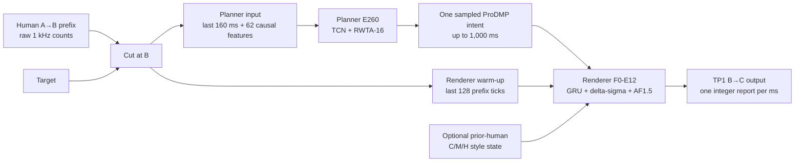

# Training and running ABCurves

ABCurves finishes a movement that a person has already started.

The person moves from **A** toward a target. At **B**, ABCurves takes over and
generates the rest of the movement to **C**. The Planner decides what that finish
should look like. The Renderer turns the smooth plan into the integer `dx, dy`
reports a real mouse would send every millisecond.



This guide starts with the easiest way to run the finished pipeline. The exact
training settings are further down the page, after the ideas behind them are clear.
Dataset preparation has its own [plain-language guide](DATASET.md).

## Try the finished models first

Python 3.10 or newer is required. From the repository root:

```bash
python -m venv .venv

# Windows PowerShell
.\.venv\Scripts\Activate.ps1

# macOS or Linux instead
# source .venv/bin/activate

python -m pip install -e ".[all,dev]"
python examples/quickstart.py
python examples/streaming.py
python -m pytest
```

The released models run on CPU. A CUDA GPU is useful when training them again, but
it is not needed for inference.

The shortest complete example looks like this:

```python
import numpy as np
from abcurves import Pipeline

prefix = np.asarray(prefix_raw_dxdy, dtype=np.float32)

with Pipeline.from_pretrained() as pipeline:
    counts = pipeline.generate(
        prefix,
        target_rel_at_B=(140.0, -22.0),
        target_radius=18.0,
        progress_center=0.74,
        seed=2026,
    )

# One integer dx, dy mouse report for every millisecond of B -> C.
print(counts.shape, counts.dtype)  # (duration_ms, 2), int16
```

[`examples/quickstart.py`](../examples/quickstart.py) is a runnable version.

### What the inputs mean

Everything is measured in **raw mouse counts**, before desktop sensitivity or
cursor acceleration is applied.

- `prefix_raw_dxdy` is the real A -> B recording. Its shape is `(P, 2)`, with one
  closed 1 ms `dx, dy` bin per row. The final row ends at B.
- `target_rel_at_B=(x, y)` says where the target centre is relative to the cursor
  at B, in the same count space.
- `target_radius` is the target radius in counts and must be positive.
- `progress_center` says how far the cursor has travelled from A toward the target
  centre. It comes from the B trigger described below.

Do not mix desktop pixels and raw counts. Do not smooth or interpolate the human
prefix before passing it in. If the mouse reports faster or slower than 1 kHz,
first collect its reports into causal, closed 1 ms count bins. That is the clock
the released models learned.

The event `seed` makes sampling repeatable. The same input and seed produce the
same Planner choice and Renderer output. A different seed asks the model for
another plausible finish. It does not generate several answers and pick the nicest
one. Renderer sampling uses counter-based SplitMix64 keyed by event seed and tick.
Each event therefore owns its random stream, and another request cannot quietly
change the result through process-global randomness.

## Running it live

Create one `Pipeline` when your process starts and keep it alive. At B, the split
streaming API lets prefix warm-up begin while your application finishes resolving
the target geometry:

```python
with Pipeline.from_pretrained(prewarm=True) as pipeline:
    pending = pipeline.begin_at_b(prefix_raw_dxdy)

    stream = pending.finish(
        target_rel_at_B=target_rel_at_B,
        target_radius=target_radius,
        progress_center=progress_center,
        planner_seed=event_seed,
        renderer_event_seed_u64=event_seed,
    )

    while not stream.complete:
        dx, dy = stream.step()
        send_one_1khz_report(int(dx), int(dy))
```

`begin_at_b()` copies the prefix, so the caller may safely reuse its own buffer. It
also starts the target-independent Renderer warm-up on a worker. `finish()` binds
the final target geometry, samples one Planner head, and returns a stream that owns
all state for that event.

Each `PendingB` can be finished once. Never share one `PreparedStream` between
events. Use `render_remaining()` when you want the complete continuation instead
of one report at a time. If all B geometry is already known,
`pipeline.prepare(prefix, ...)` performs both stages in one call.

Compute optional style state once before the event and keep it fixed for the whole
stream. The runtime copies it into the event, so later history updates cannot change
an output already in progress.

[`examples/streaming.py`](../examples/streaming.py) shows the full loop.

`prewarm=True` is the default, as is one Torch CPU thread. Prewarming pays for model
loading, ProDMP caches, Numba compilation, and worker startup once. Creating a new
pipeline for every movement throws that work away. If you change `torch_threads`,
benchmark the whole application because PyTorch's thread setting affects the
process, not only ABCurves.

## Finding A and B without looking ahead

The live seam helpers in [`abcurves/seam.py`](../abcurves/seam.py) make their
decisions only from mouse reports that have already arrived. Feed
`OnsetDetector` and `BTrigger` once per closed 1 ms bin.

### Finding A

A is the estimated start of purposeful movement toward the target. After 12 moving,
target-aligned bins confirm the movement, A is placed four bins before that run
began. This puts A closer to the true onset without using future information.

| Setting | Released value |
| --- | ---: |
| Quiet/noise window | 24 ms |
| Normal speed threshold | `max(0.35, median + 6 * MAD)` counts/ms |
| Minimum target alignment cosine | 0.15 |
| Consecutive qualifying bins | 12 |
| Backtrack before the qualifying run | 4 ms |

If capture begins after the hand is already moving, the 24 ms baseline can be
contaminated. When its median is already above `0.35`, the detector falls back to
the `0.35` floor so the bad baseline cannot hide A.

Keep a short ring buffer. `OnsetEvent.index` points to the estimated earlier A, not
the tick when the detector finally confirmed it.

### Choosing B

After A, arm `BTrigger` with the target vector and radius. B fires when the cursor
has covered 80% of the distance from A to the **near edge of the target**, as long
as there is still enough useful movement left to generate.

The hand-off is accepted only when all of these are true:

- the cursor is still outside the target;
- at least 8 counts remain;
- progress toward the target centre is no greater than 0.92;
- A -> B is no longer than 1,500 ms;
- progress has not regressed by more than 0.18.

The 24 ms prefix and 12 ms future limits belong to offline dataset preparation,
where the complete recorded movement is available. A live trigger cannot inspect a
future that has not happened yet.

`BFire.progress_edge` explains why the trigger fired. Pass
`BFire.progress_center` to the Planner. They are intentionally different, and the
difference becomes important for large targets.

If a movement cannot produce a valid B, leave that movement to the person or your
application's normal fallback. Moving B later in secret would create a different
system from the one trained and measured here.

## What the Planner learns

The Planner does not guess hundreds of future mouse reports one by one. That would
give every millisecond a chance to drift and would encourage the model to blur many
valid human finishes into one dull average.

Instead, it predicts a compact smooth movement using ProDMP. The position and
velocity at B are built into that representation, so the generated curve begins
from the motion the hand was already making. Forty-two curve values describe both
axes, and one more value describes duration.

Human beings do not always finish the same prefix in the same way. The Planner
therefore keeps sixteen possible answers, called heads. During training, the head
closest to the real finish receives most of the lesson while the others receive a
small amount so they stay alive. This is relaxed winner-takes-all, or RWTA-16. At
runtime one head is chosen uniformly. There is no ensemble, best-of-K search, or
output reranking.

### The released Planner at a glance

The checkpoint is named E260 because it is the terminal result after 260 training
epochs.

| Part | Released setting |
| --- | --- |
| Input prefix | Last 160 raw 1 ms bins plus a validity channel |
| Extra context | 62 causal movement and target features |
| Network | Width-96 causal TCN with 3 temporal blocks and dropout 0.15 |
| Output | 16 heads, 43 values per head |
| ProDMP | 20 forcing bases plus learned goal, alpha 25, phase alpha 3, ridge `1e-3` |
| Maximum planned future | 1,000 ms |
| Parameters | 369,904 |

`planner_head=` is available for inspection and tests. Uniform random head
selection is the released inference rule.

### Preparing Planner examples

Planner training uses many possible B seams without letting a long event count as
many separate people. For each physical movement, the builder requests 21 edge
progress cuts:

- B78 through B90 when the edge distance is below 150 counts;
- B78 through B92 for longer movements; and
- exact B80 for validation and other non-training splits.

Cuts that land on the same 1 ms tick are deduplicated. At every epoch, the sampler
takes one available cut from each physical source using a deterministic shuffled
cycle, then shuffles the sources. Each source therefore has total training weight
one even if it has many cuts or tiny-target variants.

The frozen training set contained 21,302 physical source trials per epoch. Across
260 epochs that was 5,538,520 source-level exposures.

Run the dataset builder first:

```bash
python tools/prepare_dataset.py path/to/events.npz prepared/ \
  --config configs/final_v2.json --branch both
```

The input may also be a directory of validated Capture research exports. See
[Building the datasets](DATASET.md) for both input formats and the filtering rules.

### The exact Planner recipe

| Part | Released setting |
| --- | --- |
| Optimizer | AdamW |
| Learning rate / weight decay | `1e-3` / `1e-4` |
| Batch size / gradient clip | 128 / 5.0 |
| Training length | 260 epochs; terminal epoch is exported |

The loss looks at six useful parts of a finish: endpoint, path, speed, duration,
initial direction, and excessive turning. Their weights are
`1.0 / 0.6 / 0.5 / 0.75 / 0.8 / 0.3`.

The last term is a guard against turns outside the range seen in human training
movement. The code adds up `1 - cosine` per 100 ms. This is simply a consistent
turning score, not an angle in degrees. Its duration-conditioned human p95 limits
are fitted before training. The released checkpoints store
`0.381892 / 0.838709 / 0.708528` for
durations `<150 / 150-250 / >=250 ms`.

RWTA begins fairly relaxed so all heads can learn, then becomes more decisive. For
the winning head, the mass is `1 - epsilon`; every other head receives
`epsilon / 15`.

```text
epsilon(epoch) = 0.50 + (0.05 - 0.50) * min(1, (epoch - 1) / 45)
```

Epoch 1 uses `0.50`. Epoch 46 reaches `0.05`, after 45 intervals, and that value is
held through epoch 260. The early part lets the heads spread out; the long floor
lets their different roles settle.

Train seed 7 and seed 23 as two independent complete runs:

```bash
python training/train_planner.py \
  --train prepared/planner_train.npz --val prepared/planner_val.npz \
  --out runs/planner_seed7.pt --epochs 260 --wta-anneal-epochs 45 \
  --heads 16 --cut-sampling one_per_source_per_epoch \
  --model-selection-interval 0 --prefix-representation raw \
  --seed 7 --device cuda

python training/train_planner.py \
  --train prepared/planner_train.npz --val prepared/planner_val.npz \
  --out runs/planner_seed23.pt --epochs 260 --wta-anneal-epochs 45 \
  --heads 16 --cut-sampling one_per_source_per_epoch \
  --model-selection-interval 0 --prefix-representation raw \
  --seed 23 --device cuda
```

`--model-selection-interval 0` means that only the terminal epoch is eligible for
export. The trainer refuses to overwrite an existing file. Use `--device cpu` if
CUDA is unavailable. The small files under `examples/` are inference and evaluation
fixtures; use the source-balanced files produced by `prepare_dataset.py` for a real
retrain.

## What the Renderer learns

The Planner's curve is deliberately smooth. A mouse is not. Real 1 kHz hardware
reports contain zeros, bursts of integers, skipped polls at speed, quantization, and
small correlations from one millisecond to the next.

The Renderer learns to put that packet texture back without moving the intended
endpoint. A hysteretic delta-sigma accumulator keeps track of fractional movement.
A small GRU decides whether to emit during the current millisecond and which nearby
integer offset to use. Before B, the real prefix warms the same state so the texture
continues across the seam instead of switching on suddenly.

At each tick, its 21 inputs describe the local smooth motion, accumulator state,
previous emission, current quiet run, and a summary of the prefix's packet regime.
Nothing from the unseen future is used.

Renderer training is self-supervised. Smooth versions of a real raw movement become
the input plan, while the original packets remain the answer. No separate texture
labels are required.

### The released Renderer at a glance

The base checkpoint is called F0-E12. F0 identifies the frozen base recipe and E12
means 12 training epochs.

| Part | Released setting |
| --- | --- |
| Network | 21-input GRU, hidden width 96 |
| Outputs | Emit decision plus 121 joint offsets in `[-5, 5] x [-5, 5]` |
| Prefix warm-up / regime summary | 128 / up to 256 ticks |
| Parameters | 80,378 |
| Emit / offset-magnitude temperature | 1.0 / 1.0 |
| Offset-direction temperature | 0.3 |
| Axis hysteresis | 1 count |
| Accumulator safety release | 48 counts |
| Maximum emitted count per axis | 127 |
| Recent cadence window | 60 ms |

The stream ends when the Planner duration ends. This terminal policy is called TP1.
It does not force an extra packet onto the final tick. The 48-count accumulator
guard remains active throughout the event.

AF1.5 is a small anti-flip rule for rare, large sideways packet changes. It applies
a penalty of `1.5 * max(abs(offset dot normal) - 1, 0)` to sampling logits. A
one-count sideways band remains free, and the smooth plan itself is not changed.

### Preparing Renderer examples

The Renderer gets one successful B80 continuation from each physical movement. It
does not receive the Planner's dense cuts, tiny-target augmentation, or
trajectory-shape filters. Those would quietly change the packet distribution it is
trying to learn.

For each raw movement, triangular moving-average teachers with windows 5 and 9 make
two smooth views. Training samples them equally. Prefix warm-up ticks are supervised
with weight 1.0.

The released population contained 9,858 successful movements, exactly one per
physical source.

### The exact Renderer recipe

| Part | Released setting |
| --- | --- |
| Optimizer | Adam |
| Learning rate / weight decay | `2e-3` / `1e-5` |
| Batch size / gradient clip | 256 / 5.0 |
| Training length | 12 epochs |

```bash
python training/train_renderer.py \
  --train prepared/renderer_train.npz --out runs/renderer_seed7.pt \
  --epochs 12 --offset-radius 5 \
  --seed 7 --device cuda

python training/train_renderer.py \
  --train prepared/renderer_train.npz --out runs/renderer_seed23.pt \
  --epochs 12 --offset-radius 5 \
  --seed 23 --device cuda
```

These commands train the 80,378-parameter base Renderer. They do not silently
retrain the optional style system described next.

## Letting recent human movements guide texture

The base Renderer works without personal history. When an application has a clean
run of earlier human movements, the optional causal style state can gently nudge its
packet texture toward that recent local rhythm.

The idea is intentionally narrow. A frozen scorer turns each completed **human**
event into three texture numbers:

- `C` describes cadence and zero runs;
- `M` describes packet magnitude;
- `H` describes high-frequency texture.

Here `C` is only the name of a texture score. It is not endpoint C in A -> B -> C.

Before a new event, the system averages the previous ten supported human events in
the same uninterrupted run, shrinks that average by `0.5`, and clips each value to
`[-2.5, 2.5]`. The current event is never included. Generated events are never fed
back as if they were human. If ten valid earlier observations are not available, or
the context cannot be scored exactly, the state is `[0, 0, 0]`.

That zero is a real control path, not an estimate. It bypasses the adapter exactly
and gives the complete generic Renderer.

### What counts as the same run

Use a new `run_id` for every new session or block, and whenever this semantic
signature changes:

```text
(task_type, challenge_id, target_role, cut_id)
```

If an older signature returns after another one intervenes, start a new run rather
than resuming its history. `run_id` is bookkeeping only; it is not passed to the
model as a feature.

The adapter has rank 4, 780 parameters, and no biases. It modifies only the
Renderer's emit and offset output heads. Its result is not fed back into the GRU
recurrence. In compact form:

```text
h' = h + U(tanh(Wh h) * tanh(Ws s))
```

### Safe live order

Read the style state before an event starts. Observe an event only after it has
finished, and only if it remained genuinely human:

```python
from abcurves import CausalStyleState
from abcurves.style_scorer import (
    FrozenStyleScorer,
    completed_human_context,
)

style = CausalStyleState()
scorer = FrozenStyleScorer()

# Before event t. Only completed human events before t can contribute.
causal_state = style.before_event(run_id)
counts = pipeline.generate(
    prefix,
    target_rel_at_B=target_rel_at_B,
    target_radius=target_radius,
    progress_center=progress_center,
    causal_c_state=causal_state,
    seed=event_seed,
)

# If event t stayed human, add it only after its B -> C stream is complete.
context = completed_human_context(
    prefix,
    human_raw_bc,
    target_rel_at_B,
    target_radius,
    progress_center,
    task_type=task_type,
    target_role=target_role,
    target_distance_at_a=target_distance_at_A,
    edge_trigger_progress=0.80,
    edge_realized_progress=b_fire.progress_edge,
)
scorer.observe_completed_human(
    style,
    run_id,
    human_raw_bc,
    context,
)
```

[`CausalStyleState`](../abcurves/personalization.py) owns the history, support
count, shrinkage, clipping, and resets. The shared
[`style_scorer.json`](../models/style_scorer.json) and
[`FrozenStyleScorer`](../abcurves/style_scorer.py) contain the exact transform, which
never reads a person's identity. This frozen Stage-0 scorer starts from the 19-value
`texture19` panel, removes predictable variation from causal context with a frozen
ridge model, scales the residuals, and projects them into the safe C/M/H scores.

The context helper joins the observed A→B prefix and completed human B→C,
smooths the whole A→C path with the canonical triangular window 5, then slices
at B. Smoothing B→C alone changes the seam and is not equivalent. Its seven
`planned::` fields come from this completed human path, not from a hidden Planner
rollout. Optional `prefix_mask` and `completed_mask` arguments support padded rows.
Supplying the known distance at A and edge progress is best; exact fallbacks are
documented in the helper's docstring.

`task_type` and `target_role` use the frozen vocabularies `TASK_LABELS` and
`TARGET_ROLE_LABELS` in [`style_scorer.py`](../abcurves/style_scorer.py). There is
no guessed `unknown` label. If required metadata is missing, do not observe the
event and omit `causal_c_state`; the pipeline will use exact zero. Never substitute
a roughly similar task, a user identity, or any measurement from a generated
future.

This public path was compared row for row with all 9,858 frozen Renderer events.
The rebuilt context differed by no more than `1.41e-15`, and the resulting C/M/H
scores by no more than `8.8e-14`, which is floating-point roundoff.

The released adapters were trained for 12 epochs with their matching base Renderer
frozen, no checkpoint selection, rank 4, and no biases. Rebuilding them properly
needs the full contributed corpus with its real chronological run boundaries. The
training must keep collection keys separate and build every style state from the ten
earlier human movements only. The small public examples do not contain that history,
so the repository ships the frozen scorer and both matched adapters instead of
offering a shortcut that would train a different system.

Any future refit must also preserve the safe feature allowlist, nuisance ridge,
prior-only N10 construction, and exact-zero control. Feeding arbitrary session
statistics into the three adapter inputs would create a different system.

### What the training commands produce

The Planner and Renderer scripts write raw training checkpoints. They do not replace
the verified models used by `Pipeline.from_pretrained()` and are not directly
loadable through that high-level call.

A deployable model directory is a complete matched set: Planner, Renderer, compatible
adapter, style scorer, and a new manifest containing their sizes and hashes. The
runtime requires the whole set because an adapter belongs to the internal features
of the Renderer it was trained with. Do not combine a freshly trained Renderer with
an old adapter or replace one file inside the released bundle.

With correctly prepared data, the public scripts can retrain the two base networks.
They cannot rebuild the adapter without the full person-by-person chronological
history. That is the boundary between retraining the public base models and promoting
a new complete runtime cell.

## How fast it runs

The checked-in measurement is
[`benchmark_this_machine.json`](../results/inference/benchmark_this_machine.json).
It contains 200 warmed trials on Windows/AMD64 with Python 3.13.14 and the seed-7
models, timed with `time.perf_counter_ns`.

| Interval | p50 | p95 | p99 | max |
| --- | ---: | ---: | ---: | ---: |
| B call to stream ready | 587.7 us | 744.0 us | 819.8 us | 840.1 us |
| First Renderer tick | 21.5 us | 26.5 us | 27.8 us | 43.9 us |
| Later Renderer tick | 9.5 us | 12.2 us | 15.0 us | 79.9 us |

Loading, cache creation, JIT compilation, and worker warm-up took 1,003.0 ms once at
startup. On that machine, the later-tick p99 used about 1.5% of a 1 ms budget.

These are in-process CPU numbers. USB polling, firmware, operating-system
scheduling, your application's output queue, and any synchronization window are not
included. Measure those layers in the real integration.

Run the same benchmark without replacing the checked-in result:

```bash
python examples/benchmark_runtime.py --trials 200 --out benchmark_local.json
```

## Practical rules worth keeping

- Keep all geometry in raw count space and all model ticks at 1 ms.
- Split collection keys and sessions before fitting normalizers, models, or
  judges.
- Keep A and B causal. Do not confuse edge-B80 with centre progress.
- Give every physical source total optimizer mass one, even when it has many cuts.
- Sample one Planner head. Do not select the most convenient output afterwards.
- Give the Renderer one successful B80 row per physical movement.
- Treat seed 7 and seed 23 as separate complete training cells, not an ensemble.
- Keep optional style history prior-only, human-only, local to one run, and exactly
  zero when it is unsupported.
- Evaluate the composed Planner -> Renderer output, because that is what people run.
- Measure startup and application integration separately from the warmed model
  timings.

Training scripts write new checkpoint files and refuse to overwrite existing ones.
Promotion requires a matched Planner, Renderer, and adapter, release-contract checks,
tensor hashes, and a new manifest.

The exact files and seed pairing are explained in
[`models/README.md`](../models/README.md).
